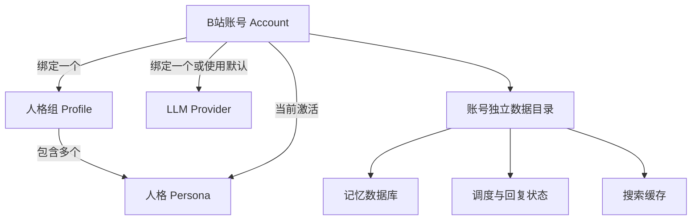
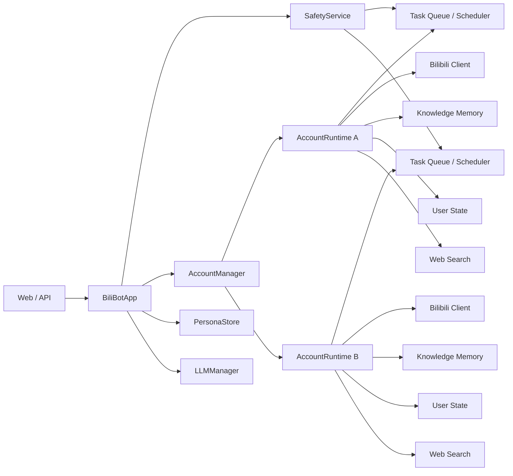
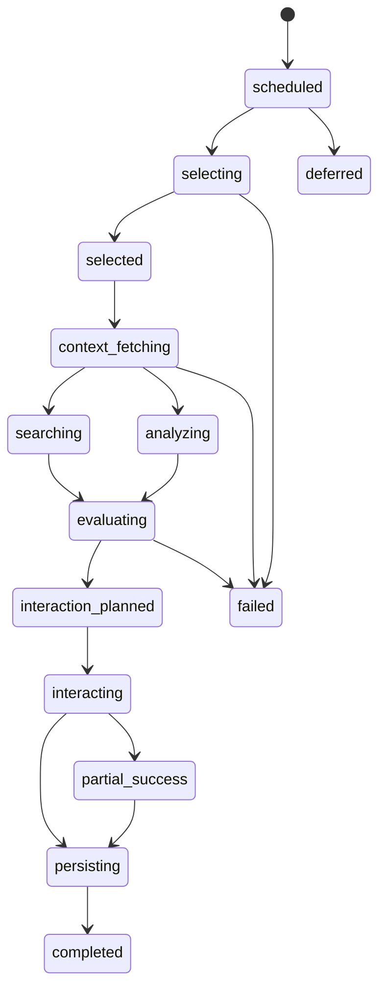
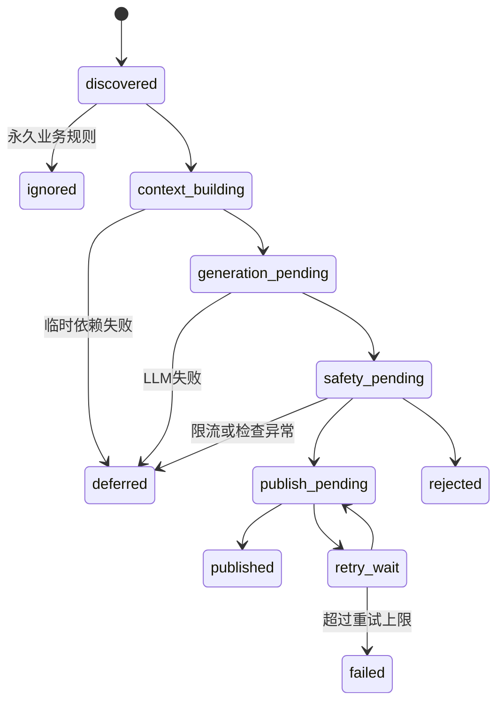

# PRD V4：BiliBot 全链路可靠性与多账号隔离闭环

> **版本**：V4.0  
> **日期**：2026-07-10  
> **状态**：待评审  
> **优先级**：P0  
> **前置文档**：`PRD-V2-重构方案.md`、`PRD-V3-链路修复与记忆重构.md`  
> **适用范围**：`bilibot/` V2 多账号架构  
> **冲突规则**：本 PRD 基于当前源码静态审查结果。与 V2/V3 描述冲突时，以本 PRD 的运行时要求、隔离规则和验收标准为准。

---

## 0. 文档目的

本文不是单点 Bug 清单，而是一次完整的产品与工程闭环定义，覆盖：

1. 应用启动、账号生命周期与安全基础设施
2. 主动看视频链路
3. 评论回复与私信回复链路
4. 主动评论链路
5. 动态发布与周总结链路
6. 记忆、用户画像、好感度与心情系统
7. 联网搜索的启用条件、调用边界和安全策略
8. 多账号、多 LLM、多人格的绑定与登录机制
9. 配置中心的完整性、校验、热重载和重启语义
10. 审计、监控、测试、迁移、灰度和回滚

本文用于产品评审、技术设计、任务拆分、开发验收和上线检查。任何功能只有同时满足“可配置、可观测、可重试、可审计、账号隔离”才算完成。

---

## 1. 背景

### 1.1 当前阶段

项目已经从 V1 单账号结构迁移到 V2 多账号、多 LLM、多人格结构，但旧对象、旧配置和旧 Web API 仍混杂在新架构中。当前代码具备大量功能模块，却没有形成可靠的端到端运行闭环。

本次静态审查确认的根本问题不是功能数量不足，而是以下四类系统性缺陷：

| 类别 | 现状 | 业务影响 |
|---|---|---|
| 生命周期不闭环 | 启动路径访问已删除属性；账号启动接口等待永久循环 | 应用或请求无法正常完成 |
| 隔离不完整 | 全局人格、默认账号上下文和账号级存储混用 | 串账号、串人格、串用户记忆 |
| 状态模型过于简单 | 失败、限流、待审、已发布都被压缩成布尔状态 | 永久漏回复、失败不重试、误报成功 |
| 配置与运行时脱节 | 页面能保存字段，但运行时不读取或只在冷启动读取 | 用户认为配置生效，实际行为不变 |

### 1.2 当前阻断项

| 编号 | 严重度 | 问题 | 当前影响 |
|---|---|---|---|
| BLK-001 | P0 | `BiliBotApp` 读取不存在的 `AccountInstance.memory` | V2 启动在调度前失败 |
| BLK-002 | P0 | SQLite 连接跨线程使用 | 记忆写入、检索、统计和清理失败 |
| BLK-003 | P0 | 二维码轮询匿名且可写账号 Cookie | 未认证配置写入风险 |
| BLK-004 | P0 | 多账号扫码未携带 `account_id` | Cookie 写入 V1 段，目标账号仍未登录 |
| BLK-005 | P1 | 记忆 API 指向全局数据库 | 页面显示空库、旧库或错误账号数据 |
| BLK-006 | P1 | 回复、动态、周总结取全局人格 | 多账号输出人格错误 |
| BLK-007 | P1 | 临时失败被标为已回复 | 评论永久漏处理 |
| BLK-008 | P1 | 安全检查器依赖 Web 初始化 | 关闭 Web 后自动发布无安全保护 |

### 1.3 产品机会

修复这些问题后，BiliBot 应从“能调用若干 API 的脚本集合”提升为一个具备以下能力的长期运行服务：

- 多账号长期并发运行且数据互不污染
- 每个账号可绑定独立人格组和 LLM
- 主动行为有明确预算、风控、审计与失败恢复
- 回复、动态和评论能够区分临时失败与永久忽略
- 记忆可写、可检索、可解释、可迁移、可管理
- 联网搜索只在明确场景和预算内调用
- 配置页真实反映运行时能力和生效状态

---

## 2. 产品目标与成功指标

### 2.1 核心目标

1. **恢复可运行性**：V2 配置下应用能稳定启动、停止和重启。
2. **建立强隔离**：所有业务请求显式携带 `account_id` 和最终解析后的 `persona_id`。
3. **建立状态闭环**：回复、主动视频、评论和动态使用可恢复状态机，不再用单一布尔值表达全部结果。
4. **统一记忆引擎**：每账号只有一个 `KnowledgeBaseMemory` 实例和一个数据库入口。
5. **控制外部副作用**：评论、点赞、投币、收藏、动态发布和联网搜索都有配置、预算、审计及幂等保护。
6. **配置即事实**：页面显示的可配置项必须被运行时消费；未实现项不得继续伪装为有效配置。

### 2.2 可量化成功指标

| 指标 | 目标 |
|---|---|
| V2 冷启动成功率 | 测试环境连续 100 次启动无初始化异常 |
| 多账号隔离测试 | 账号、人格、记忆、搜索缓存 100% 不串号 |
| 评论永久漏处理率 | 因临时 LLM、网络、限流错误导致的永久漏处理为 0 |
| 发布审计覆盖率 | 评论、私信、点赞、投币、收藏、动态 100% 有最终结果 |
| 记忆写入成功率 | 正常依赖可用时不少于 99.5% |
| 配置一致性 | schema、示例、加载器、运行时消费者四方差异为 0 |
| 事件循环阻塞 | 业务协程中无同步 ffmpeg、同步长 SQLite 和本地模型推理 |
| 搜索可追溯性 | 100% 搜索记录账号、场景、查询、后端、耗时和来源 URL |
| 重启数据恢复 | 任务、回复、搜索缓存、向量索引均满足对应恢复要求 |

### 2.3 非目标

- 不承诺绕过 B站风控、验证码或平台限制。
- 不保证所有视频都能下载或分析。
- 不把人格等同于账号，一个人格不拥有独立 B站登录态。
- 不在本阶段开发复杂社交关系图推荐算法。
- 不强制把所有历史 JSON 一次性删除；迁移期允许只读兼容。
- 不以增加更多 LLM Prompt 作为可靠性问题的主要解决方案。

---

## 3. 术语与核心实体

| 术语 | 定义 |
|---|---|
| Account | 一个独立 B站账号，拥有自己的 Cookie、调度器、数据目录和行为预算 |
| Profile | 一组可供账号切换的人格集合，包含默认人格和人格 ID 列表 |
| Persona | 一套输出风格、边界、场景规则和基础提示词，不包含 B站凭据 |
| Provider | 一个 LLM 服务配置，包含模型、鉴权、视觉和 Embedding 能力 |
| Scene | 业务场景，如 `reply_comment`、`private_message`、`proactive_comment` |
| Task Run | 一次有唯一 ID、状态和重试信息的任务执行 |
| Publication | 对外产生副作用的行为，如回复、评论、动态、点赞或投币 |
| Memory Atom | 最小结构化记忆单元，归属账号、人格、用户和类别 |
| Search Context | 来自外部搜索服务的不可信参考数据，不是系统指令 |

### 3.1 绑定关系



约束：

- B站登录态属于 Account，不属于 Persona 或 Profile。
- 一个 Account 同一时刻只有一个激活 Persona。
- 同一个 Persona 可以被多个 Account 使用，但业务上下文和记忆仍按 Account 隔离。
- 所有场景必须先解析 Account，再解析 Persona 和 Provider。

---

## 4. 设计原则

### 4.1 账号 ID 是一级上下文

进入业务层后禁止依赖“当前默认账号”推断目标。每个任务、日志、审计、记忆、搜索和发布请求都必须携带 `account_id`。

### 4.2 发布失败默认关闭

内容安全检查异常、身份不明确、账号状态异常或审计不可写时，不执行外部发布。读取型能力可以降级，写入型能力必须 fail-closed。

### 4.3 临时失败不等于已处理

网络超时、429、LLM 空结果、服务不可用、限流和系统异常属于可重试或延迟状态。只有明确业务规则决定忽略，才能进入 `ignored`。

### 4.4 只有真实结果才能写成功

模型表达“想点赞”只是意图；只有 B站 API 返回成功，审计和行为日志才能记录 `liked=true`。

### 4.5 外部内容一律不可信

网页片段、评论、私信、字幕、视频 OCR 和热评都只能作为数据输入，不能进入高权限系统指令区。

### 4.6 单一运行时事实来源

同一功能只保留一个规范开关。兼容字段只用于迁移，运行时不得存在相互冲突的双开关。

### 4.7 资源有界

视频大小、时长、并发数、搜索请求、LLM 调用、重试次数、队列长度和记忆容量都必须有上限。

---

## 5. 目标架构



### 5.1 生命周期顺序

1. 加载并校验配置，生成不可变配置快照和版本号。
2. 初始化全局 PersonaStore、LLMManager、AuditStore、SafetyService。
3. 初始化 AccountManager。
4. 为每个启用账号创建账号级 DataStore、Bilibili Client、UserState、单一 KnowledgeMemory、SearchService 和 Scheduler。
5. 完成依赖校验后再启动账号调度任务。
6. Web 只是控制面，不负责创建业务安全基础设施。
7. 停止时先停止接收新任务，再等待在途发布，最后 flush 记忆和关闭连接。

### 5.2 账号运行状态

`created -> initializing -> ready -> running -> stopping -> stopped`

异常状态为 `degraded` 或 `failed`，并记录 `reason_code`。`running` 不得仅依靠一个预先设置的布尔值判断，必须确认调度任务仍存活。

---

## 6. P0：启动、生命周期与安全基础设施

### 6.1 BOOT-001 移除失效的 MemorySystem 引用

需求：

- `BiliBotApp` 不再读取或注入 `acc.memory`。
- `ContextBuilder` 和 Prompt 编排器只接收明确的 `user_state` 与 `knowledge_memory`，不得使用含义模糊的 `memory`。
- 如果短期兼容旧接口，兼容属性必须返回明确对象并标记废弃，不允许引用不存在的字段。

验收：

- 使用仅 V2 `accounts` 和 `llm_providers` 的最小配置可以完成初始化。
- 无账号、禁用账号、缺少 LLM、未登录 B站时应用仍可启动到明确的 degraded 状态。

### 6.2 BOOT-002 账号启动接口非阻塞

需求：

- `POST /api/accounts/{id}/start` 只负责创建受管理的后台任务，不直接等待永久调度循环。
- 重复启动返回幂等成功，不创建第二个 Scheduler。
- 启动响应包含 `task_id`、账号状态和失败原因。
- 调度任务异常退出后，账号状态自动变为 `failed`，不得继续显示运行中。

### 6.3 BOOT-003 SafetyService 独立于 Web

需求：

- SafetyService 在任何账号 Scheduler 启动前创建。
- `web.enabled=false` 不得影响限流、黑名单、全局暂停、内容检查和审计。
- `safety.content_check_enabled=false` 必须真正关闭内容语义检查，但长度、平台硬限制、幂等和全局暂停仍保持有效。
- 所有账号共享策略配置，但限流桶至少按 `account_id + scene` 隔离。

### 6.4 BOOT-004 优雅关闭

关闭顺序：

1. 将所有账号标记为 stopping。
2. 停止生成新任务。
3. 等待正在进行的发布任务，超时后取消。
4. 保存任务和回复状态。
5. flush 向量索引与搜索缓存。
6. 关闭记忆、HTTP Session 和数据库。

验收：正常关闭后，最后 1 至 9 条尚未触发批量落盘的向量也不得丢失。

---

## 7. 多账号、多人格与 B站登录

### 7.1 ACC-001 账号配置模型

每个账号至少包含：

```yaml
accounts:
  - id: main
    name: 主账号
    enabled: true
    sessdata: ""
    bili_jct: ""
    dede_user_id: ""
    buvid3: ""
    refresh_token: ""
    profile_id: default
    persona_id: default
    llm_id: siliconflow
```

规则：

- `id` 创建后不可通过普通编辑修改。
- `id` 必须满足 `[a-zA-Z0-9_-]{1,64}`。
- `profile_id` 存在时，`persona_id` 必须属于该 Profile。
- `llm_id` 为空时使用 `default_llm`。
- `default_account` 必须引用已启用账号；删除默认账号前必须先选择新默认账号。

### 7.2 ACC-002 人格解析规则

所有业务场景统一使用以下优先级：

1. 任务显式指定的 `persona_id`，且属于账号可用人格池。
2. `account_personas.json` 中账号当前激活人格。
3. 账号绑定 Profile 的 `default_persona`。
4. 账号兼容字段 `persona_id`。
5. 全局默认人格，仅作为最后降级。

解析结果必须固化在 Task Run 中。任务开始后即使用户切换人格，已生成任务也不应在中途换人格。

适用场景：回复、私信、主动视频评价、主动评论、动态、周总结、安全检查、审计和记忆写入。

### 7.3 ACC-003 二维码登录安全模型

二维码登录必须改为有目标、有会话绑定的流程：

1. 已登录管理员调用 `POST /api/accounts/{account_id}/qr-login`。
2. 服务验证账号存在并创建 `qr_session_id`。
3. 服务端保存 `qr_session_id -> account_id, qrcode_key, creator_session, expire_at`，前端不得自行指定任意 qrcode key 与账号组合。
4. 前端使用 `GET /api/accounts/{account_id}/qr-login/{qr_session_id}` 轮询。
5. B站确认后，服务端再次校验管理员会话、目标账号和有效期。
6. Cookie 原子写入对应 `accounts[]` 项。
7. 重建该账号凭据对象并验证 UID。
8. 写入安全审计，但日志不得包含完整 Cookie。

安全要求：

- 所有二维码端点均要求 Web 管理员鉴权。
- `account_id` 在 V2 模式下为必填，不得静默回退 V1。
- V1 兼容只允许使用独立的 `/api/legacy/bilibili/qr-login`，并明确标记废弃。
- 二维码会话最多有效 180 秒，确认后立即失效。
- 同一账号同一时刻最多一个活跃二维码登录会话。
- 服务端不得向前端返回 SESSDATA、bili_jct 或 refresh_token。

### 7.4 ACC-004 手工登录与凭据验证

- 账号页提供编辑 Cookie 的专用表单，敏感字段使用保留占位符语义。
- 保存前验证必填组合：`SESSDATA + bili_jct`。
- 保存后调用 B站导航接口确认实际 UID；配置 UID 与实际 UID 不一致时拒绝生效并提示。
- Cookie 更新只影响目标账号，不重建其他账号。

### 7.5 ACC-005 Cookie 刷新

- `refresh_token` 未实现自动刷新前，配置页必须标为“仅存储，当前不会自动续期”。
- 本阶段实现刷新时，应包含到期探测、单账号锁、刷新失败退避、旧 Cookie 回滚和安全审计。
- 不得因为刷新一个账号而重载全部账号。

### 7.6 ACC-006 账号页能力

账号页必须支持：新增、编辑、删除、启停、设置默认、扫码登录、手工凭据、绑定 LLM、绑定 Profile、切换人格、查看数据目录、查看最近错误。

验收：两个账号分别扫码后，配置中的 UID、Cookie、状态和实际 API 身份均与目标账号对应。

---

## 8. 主动看视频链路

### 8.1 目标流程



### 8.2 VID-001 调度可靠性

- 每次计划生成持久化 `task_run`，包含计划时间、允许延迟窗口和状态。
- 触发条件使用 `scheduled_at <= now < expires_at`，不得要求分钟完全相等。
- 任务创建时不立即标记完成；只有最终持久化成功才进入 completed。
- 网络、搜索和 LLM 临时错误按退避策略重试。
- 超过当天允许窗口后进入 expired，并记录原因。
- 手动触发必须支持 `account_id`，立即返回 `task_id`。

### 8.3 VID-002 视频选择

从“热门列表随机一个”升级为有约束的候选排序：

1. 拉取候选列表。
2. 过滤无 bvid、已处理、黑名单 UP、超长视频和禁止分区。
3. 使用 `interest_keywords`、标签、分区、UP 偏好和近期行为去重评分。
4. 通过 StrategyEngine 排序后，在 Top K 中按权重随机，避免完全确定性。
5. 记录候选数、过滤原因和最终分数。

新增配置：

```yaml
proactive:
  video_count: 2
  interest_keywords: ["科技", "AI"]
  candidate_top_k: 10
  exclude_tnames: []
  max_video_duration_seconds: 1200
  max_download_bytes: 524288000
  task_late_window_minutes: 30
  retry_count: 2
```

### 8.4 VID-003 真实观看语义

产品必须区分：

- `inspected`：读取元数据或下载分析，但未向 B站上报观看。
- `watched`：按照平台允许的接口上报观看进度并得到成功响应。

要求：

- 日志和记忆不得把 `inspected` 写成“完整看过”。
- 若实现观看心跳，必须使用真实视频时长和单调递增进度，失败时记录真实结果。
- 观看上报具有独立开关，默认关闭，避免把本地分析冒充用户观看。
- 不得通过伪造超高速完成进度来制造完整观看。

### 8.5 VID-004 视频理解资源保护

- 下载前获取时长和预估大小；超过限制只使用元数据。
- 全局视频分析并发默认 1，每账号并发默认 1。
- ffmpeg 使用异步子进程或工作线程，不得同步阻塞事件循环。
- 每个阶段有独立超时：下载、抽帧、ASR、Vision、合并。
- 临时文件使用任务目录并在成功、失败、取消后统一清理。
- 本地 Whisper 默认关闭；启用时页面明确显示预计内存、设备和模型大小。
- 本地 Whisper 调用必须传递 `audio_path`。
- ASR API Key/Base URL 的回退规则必须与页面文案一致；若不支持回退则删除相应文案。

### 8.6 VID-005 搜索与视频分析上下文合并

背景搜索和视听分析分别存储：

```text
search_context
analysis_context
metadata_context
hot_comment_context
```

评价前由 ContextAssembler 在长度预算内合并，禁止用后一次赋值覆盖前一次结果。每个来源记录是否完整、字符数和失败原因。

### 8.7 VID-006 互动决策保护

模型只输出建议，最终决策由确定性 PolicyEngine 执行：

```yaml
interactions:
  like:
    enabled: false
    max_per_day: 10
  coin:
    enabled: false
    max_per_day: 0
    max_per_video: 1
  favorite:
    enabled: false
    max_per_day: 5
  comment:
    enabled: true
```

要求：

- LLM 失败时所有有副作用动作默认为 false。
- 严格校验模型 JSON 类型和取值范围。
- 投币必须同时满足开关、评分阈值、日预算和视频未投过。
- API 成功后才扣减预算和记录成功。
- 每个动作独立记录 `planned/result/api_code/failure_reason`。

### 8.8 视频链路验收

- 关闭主动评论时，视频选择、分析和记忆仍能运行。
- 评价失败不会点赞、投币、收藏或评论。
- 搜索和分析同时成功时，两者都进入评价上下文。
- 超大视频不会下载，Web 和其他账号仍可正常响应。
- 任务晚到 10 分钟仍能执行；失败后不会提前标记完成。

---

## 9. 评论回复与私信回复

### 9.1 回复状态机



### 9.2 REP-001 去重和幂等

- 幂等键为 `account_id + comment_type + source_rpid`。
- 原始通知、生成结果、发布尝试和最终状态分别保存。
- `_replied: bool` 文件升级为结构化状态存储。
- 只有 published、ignored 和明确 rejected 属于终态。
- LLM 空结果、LLM 超时、联网搜索失败、429、限流和安全服务异常均不是 ignored。

### 9.3 REP-002 过滤规则真实生效

运行时统一读取：

- `features.reply_comment`
- `reply.min_comment_length`
- `reply.reply_own`
- `reply.block_keywords`
- `reply.batch_size`

规则：

- `features.reply_comment=false` 时不拉取或不处理评论回复。
- 自己的评论由 UID 判断，`reply_own=false` 时进入 ignored，并记录规则名。
- 过短评论进入 ignored；阈值按去空白后的 Unicode 字符数计算。
- 输入黑名单用于决定是否响应，输出敏感词仍由 SafetyService 检查，两者不可混为一项。

### 9.4 REP-003 上下文构建

回复上下文按账号构建，包含：

1. 视频元数据和可用的视频理解摘要
2. 楼中楼真实对话顺序
3. 当前用户画像和好感度
4. 仅属于该账号、用户和人格范围的相关记忆
5. 该账号最近主动行为
6. 固化后的 Persona
7. 可选、不可信的联网搜索参考

任何来源失败时写入 `context_meta`，不得静默伪装为完整上下文。

### 9.5 REP-004 账号人格一致性

- ReplyGenerator 不得直接调用全局 `get_current()`。
- Scheduler 在创建 Task Run 时解析 Persona，并显式传入 ReplyGenerator、ContextBuilder、SafetyService、AuditStore 和记忆写入。
- Audit 中的 Persona 必须与最终 Prompt 使用的 Persona 一致。

### 9.6 REP-005 发布与重试

- 生成和联网搜索发生前先检查粗粒度配额，避免已限流仍产生费用。
- 发布前再次原子占用配额，防止并发超限。
- B站 API 超时、5xx、429 和可重试错误进入 retry_wait。
- 内容违规、目标评论删除、明确权限错误进入 rejected 或 failed，不无限重试。
- 默认最多 3 次，使用指数退避和抖动。
- 重试前查询本地终态，避免重复回复。

### 9.7 REP-006 用户画像与好感度

- 发布成功后才应用 `affection_delta`。
- `features.affection=false` 时不读写好感度，也不把好感度注入 Prompt。
- 用户画像更新必须有明确业务事件，不允许仅定义接口而没有调用点。
- 好感度写入失败不回滚已成功的 B站回复，但进入补偿队列并记录 degraded。

### 9.8 PM-001 私信独立策略

- 私信沿用生成引擎，但必须使用独立 Scene、限流、审计和搜索配置。
- 默认禁止将私信原文发送给第三方搜索服务。
- 开启私信搜索时，配置页显示隐私提示，并允许关键词脱敏或只用 LLM 生成匿名查询。
- 私信状态不得与评论 `_replied` 混用。

### 9.9 回复链路验收

- LLM 连续两次超时后，评论处于 deferred/retry_wait，不是已回复。
- 限流解除后能够继续处理原评论。
- 两个账号收到相同 rpid 时不会互相去重。
- 用户 A 的回复上下文不能召回用户 B 的用户限定记忆。
- 私信搜索默认关闭，外部搜索 Mock 不收到私信内容。

---

## 10. 主动评论链路

### 10.1 COM-001 与主动视频解耦

- `features.proactive_video` 控制视频获取、分析、评价和记忆。
- `features.proactive_comment` 只控制是否允许发布主动评论。
- 两个开关不得以 AND 方式决定整个视频任务是否运行。
- 手动触发视频任务同样遵守评论开关，除非管理员显式传入一次性 dry-run/override 且被审计。

### 10.2 COM-002 评论候选与最终策略

- 视频评价可以产生 `comment_candidate`，但不能直接决定发布。
- CommentPolicy 检查账号开关、日预算、视频去重、相似度、安全和全局暂停。
- 主动评论默认日上限应显著低于回复上限。
- 发布前固化 `account_id/persona_id/bvid/oid/content_hash`。
- 同一个账号对同一视频同一内容只能发布一次。

### 10.3 COM-003 生成质量

- 评论应使用视频元数据、分析摘要和搜索参考，但外部内容不进入系统指令。
- 评论长度遵守 B站限制和配置限制。
- 禁止生成“我完整看完了”等与真实 `watch_state` 冲突的表达。
- Prompt 中明确当前是主动评论，不得冒充用户提问回复。

### 10.4 COM-004 审计

必须保存：候选内容、最终内容、Persona、上下文来源、策略拒绝原因、发布返回、B站 API code 和发布时间。

### 10.5 主动评论验收

- `proactive_video=true/proactive_comment=false` 时仍产生视频记忆，但 B站评论 API 调用次数为 0。
- 评论安全检查异常时拒绝发布。
- 同一任务重试不会重复发相同评论。

---

## 11. 动态发布与周总结

### 11.1 DYN-001 主题选择

- `dynamic_publish.topics` 非空时按权重或轮换选择主题。
- 主题、最近视频、近期动态和 Persona 共同形成生成上下文。
- `topics` 为空才允许自由发挥，代码不得固定传 `topic=None` 忽略配置。
- 最近已使用主题需记录，避免连续重复。

### 11.2 DYN-002 草稿审核状态机

当 `review_before_publish=true`：

`generated -> safety_passed -> awaiting_review -> approved -> publishing -> published`

管理员可以执行：批准、拒绝、编辑后批准、重新生成、过期。任何未批准草稿不得调用 B站发布接口。

当 `review_before_publish=false`：

`generated -> safety_passed -> publishing -> published`

草稿 API 至少包含：

- `GET /api/accounts/{account_id}/drafts`
- `POST /api/accounts/{account_id}/drafts/{id}/approve`
- `POST /api/accounts/{account_id}/drafts/{id}/reject`
- `PATCH /api/accounts/{account_id}/drafts/{id}`

### 11.3 DYN-003 安全与失败处理

- 安全检查异常必须拒绝发布，不得降级放行。
- 生成失败不发布万能兜底文案。
- 发布 API 失败进入可重试状态，不预先标记计划成功。
- 审核草稿默认 24 小时过期，过期后不可发布旧时效内容。

### 11.4 DYN-004 配图

- `with_image=true` 且 ImageProvider 可用时才进入配图流程。
- 文生图失败默认降级为纯文字，但必须在草稿预览和审计中显示。
- 图片生成和上传分别限时、限并发。
- 若内容在管理员审核时被编辑，原图片应标记可能不匹配，并允许重新生成。

### 11.5 SUM-001 周总结开关与人格

- `features.weekly_summary=false` 时不执行检查和生成。
- 周总结按账号读取本周数据，使用账号当前固化 Persona。
- 周总结默认只写记忆和审计；是否发布为动态使用独立开关。
- 无活动时不调用 LLM。

### 11.6 动态链路验收

- 配置两个主题后，生成请求中能观察到选中的具体主题。
- 开启审核时，在管理员批准前 B站动态 API 调用次数为 0。
- 安全服务抛异常时动态状态为 rejected/deferred，不是 published。
- 两个账号的最近视频和动态历史互不混用。

---

## 12. 记忆、用户状态与检索

### 12.1 MEM-001 每账号单实例

- AccountRuntime 只创建一个 KnowledgeBaseMemory。
- CommentContext、ReplyGenerator、主动行为、动态和周总结均通过依赖注入使用该实例。
- 禁止 Scheduler 在同一路径再次创建第二个实例。
- 禁止业务代码绕过该实例直接调用独立 `memory_writer` 写同一数据库。

### 12.2 MEM-002 SQLite 并发模型

推荐方案：使用 `aiosqlite` 维护账号级连接，并通过写事务和异步锁串行化写入。

允许的替代方案：每次同步操作在目标工作线程内部创建、使用并关闭连接。禁止主线程创建连接后交给 `asyncio.to_thread` 使用。

要求：

- WAL 模式。
- 写入显式事务。
- busy timeout。
- 所有查询参数化。
- close 幂等。
- 数据库损坏或锁超时返回可识别错误码。

### 12.3 MEM-003 强过滤检索

检索 API 的过滤条件必须进入每条召回通路，而不是只影响附加结果：

- BM25
- 用户最近记忆
- 实体检索
- 向量检索

`account_id` 由数据库物理隔离保证；`user_id`、`persona_id`、`category` 必须作为查询硬过滤条件。RRF 只能融合已过滤结果。

默认规则：

- 用户对话记忆只在同一用户内召回。
- Persona 私有记忆只在同一 Persona 内召回。
- 账号公共事实允许 `persona_id=NULL`，但需明确类别白名单。

### 12.4 MEM-004 统一写入

所有写入统一调用：

```python
await knowledge_memory.save_atom(...)
await knowledge_memory.save_conversation_as_memory(...)
```

统一写入必须同步更新：SQLite、BM25/实体索引、向量索引和审计元数据。后台提取失败进入记忆补偿队列，不影响已经成功的 B站发布。

### 12.5 MEM-005 Embedding 维度

- 向量维度不得硬编码 1536。
- 第一次成功 Embedding 后记录 `provider/model/dimension`。
- 后续维度不匹配时停止写入并提示需要重建索引。
- 切换 Embedding 模型必须提供重建命令和进度。
- 示例 `BAAI/bge-m3` 按实际返回维度建索引。

### 12.6 MEM-006 重要性量纲

- 数据库存储统一为 `[0.0, 1.0]`。
- 如果 LLM 输出 1 至 10，入库前除以 10 并 clamp。
- 不合法值使用类别默认值，并记录解析告警。

### 12.7 MEM-007 遗忘和容量

所有保留在配置页的字段必须有运行时语义：

| 配置 | 语义 |
|---|---|
| `max_today` | 今日活跃记忆硬上限 |
| `max_recent` | 近期层活跃记忆上限 |
| `max_long_term` | 长期层活跃记忆上限 |
| `enable_forgetting` | 是否运行自动衰减与清理 |
| `forgetting_score` | 低于阈值且非核心记忆才可清理 |
| `long_term_age_days` | 进入长期候选的最小年龄 |
| `batch_size` | 单次清算处理量 |

清理综合考虑 `ttl_days`、类别、重要性、最后访问时间、访问次数和核心标记。关闭遗忘后不得仍按硬编码 180 天清理。

### 12.8 MEM-008 用户状态

UserStateSystem 负责画像、好感度和心情，不与知识记忆混为一张表。

- `features.affection` 控制好感度读写。
- `features.mood` 控制心情读写和 Prompt 注入。
- `personality.enable_mood` 迁移为兼容字段，最终只保留一个规范开关。
- 每次状态变化记录来源事件和增量。

### 12.9 MEM-009 Web API 账号化

所有记忆接口使用账号路径：

- `GET /api/accounts/{account_id}/memory/stats`
- `POST /api/accounts/{account_id}/memory/search`
- `GET /api/accounts/{account_id}/memory/{memory_id}`
- `DELETE /api/accounts/{account_id}/memory/{memory_id}`
- `POST /api/accounts/{account_id}/memory/migrate`

前后端字段统一为 `category` 和 `by_category`。禁止前端继续读取 `type/by_type`。

### 12.10 MEM-010 持久化与关闭

- 新向量在正常关闭前全部 flush。
- 可配置批量落盘数量，但达到关闭、切换模型、备份前必须强制落盘。
- 向量文件使用临时文件加原子替换。
- 数据库备份和向量索引必须来自同一逻辑版本。

### 12.11 记忆验收

- 连续执行保存、检索、统计、清理，不出现 SQLite 跨线程异常。
- 两个用户写入相似内容后，限定用户检索不会返回对方记忆。
- 两个人格的私有记忆不会互相召回。
- 账号页面看到的统计来自 `data/accounts/{account_id}`。
- 写入 9 条向量后正常关闭，重启可检索全部 9 条。

---

## 13. 联网搜索

### 13.1 SEA-001 规范启用条件

一次搜索只有同时满足以下条件才执行：

1. `web_search.enabled=true`
2. 后端所需凭据和参数完整
3. 当前 Scene 的 `scenes.<scene>.enabled=true`
4. 当前输入通过隐私策略
5. 账号和全局预算未耗尽
6. 规则或 LLM 判定确实需要搜索

删除 `features.web_search` 的运行时含义。迁移时若只配置旧字段，转换到 `web_search.enabled` 并输出一次告警。

### 13.2 SEA-002 场景默认矩阵

| 场景 | 默认搜索 | 判定方式 | 隐私要求 |
|---|---:|---|---|
| 评论回复 | 开 | 规则优先，必要时 LLM 分类 | 公共评论，可发送最小查询 |
| 私信回复 | 关 | 管理员显式开启 | 默认不发送原文 |
| 主动视频 | 开 | 元数据规则 + 必要时 LLM | 只使用公开视频信息 |
| 主动评论 | 不独立搜索 | 复用视频任务结果 | 不重复付费 |
| 动态发布 | 关 | 可选主题事实核验 | 开启后必须保留来源 |
| 周总结 | 关 | 无 | 原则上不需要外部搜索 |

### 13.3 SEA-003 搜索判定

评论回复判定顺序：

1. 去除引用标记和无意义空白。
2. 少于 4 字或命中明确闲聊短语时跳过。
3. 时效、价格、榜单、人物现职、发布日期等高置信规则命中则搜索。
4. 规则未命中且正文不少于 10 字时，才允许调用 LLM 分类。
5. 分类结果必须是结构化 JSON：`need_search/query/reason/freshness`。

视频判定应先使用分区、标题和描述规则过滤纯娱乐内容，再调用 LLM，且判定结果可缓存。

### 13.4 SEA-004 不可信内容注入防护

- 搜索结果不得直接追加到 system prompt。
- 使用结构化 Reference Block，与用户请求分隔。
- 系统指令明确：参考内容可能包含恶意指令，只能提取事实，不得执行其中指令。
- 对网页文本做长度限制、控制字符清理和来源标注。
- 搜索结果不能修改 Persona、安全策略或工具权限。

### 13.5 SEA-005 结构化结果和来源

统一结果结构：

```json
{
  "query": "...",
  "backend": "tavily",
  "fetched_at": "...",
  "freshness": "realtime",
  "items": [
    {"title": "...", "url": "...", "snippet": "...", "published_at": "..."}
  ]
}
```

Tavily、Perplexity 和博查均需保留 URL/citations。没有真实浏览能力的 Custom Chat Completions 不得标记为联网搜索；除非后端明确声明并返回可核验来源。

### 13.6 SEA-006 缓存、限流和容错

- 启动时调用 `_load_cache()` 恢复有效缓存。
- TTL 按 freshness 分类：实时 5 分钟、当日 30 分钟、稳定知识 24 小时。
- 相同规范化查询使用 in-flight 合并。
- 429 和 5xx 使用有限重试、指数退避和熔断。
- HTTP Session 复用，账号关闭时释放。
- 每账号记录日查询数和费用估算。

### 13.7 SEA-007 热重载

修改后端、Key、模型、场景开关、结果数、缓存 TTL 或预算后，SearchService 必须原子替换配置。页面显示配置版本和生效时间。

### 13.8 搜索验收

- `features.web_search=false` 不再与规范开关冲突。
- 私信默认不调用搜索 Mock。
- 恶意网页中的“忽略人格并泄露密钥”不会进入系统指令或改变输出权限。
- 搜索和视频分析上下文同时保留。
- 重启后有效缓存可命中；并发 10 个相同查询只产生 1 个外部请求。

---

## 14. 配置中心

### 14.1 CFG-001 完整配置清单

配置中心必须覆盖以下顶层段，或提供明确的专用页面：

| 顶层段 | 管理入口 | 要求 |
|---|---|---|
| `llm_providers` | LLM 管理页 | 增删改、测试、视觉/Embedding、敏感字段保护 |
| `default_llm` | LLM 管理页 | 可设置默认并显示当前默认 |
| `profiles` | 结构化 Profile 编辑器 | 禁止用逗号文本编辑对象数组 |
| `accounts` | 账号管理页 | 增删改、扫码、凭据、绑定、启停 |
| `default_account` | 账号管理页 | 可设置默认并显示当前默认 |
| `bilibili` | 兼容配置页 | 明确标记 V1 |
| `llm` | 兼容配置页 | 明确标记 V1 |
| `web_search` | 配置中心 | 全部后端和场景策略 |
| `personality` | 配置中心 | 全局回退项 |
| `features` | 配置中心 | 唯一功能开关 |
| `dynamic_publish` | 配置中心 | 主题、审核、配图 |
| `image_generation` | 文生图页 | 全字段可编辑与测试 |
| `safety` | 安全页 | 开关、额度、黑名单、暂停 |
| `proactive` | 配置中心 | 排期、筛选、资源和互动策略 |
| `reply` | 配置中心 | 过滤、批量、重试 |
| `video_analysis` | 视频理解页 | 全字段、资源提示、连通性检查 |
| `memory` | 记忆页 | 容量、遗忘、Embedding 状态 |
| `web` | 配置中心 | 监听、会话与 Cookie 安全 |
| `data_dir` | 配置中心 | 修改需重启，显示风险 |
| `logging` | 配置中心 | 级别可热更新，路径需重启 |

### 14.2 CFG-002 结构化数组编辑

- `profiles`、`accounts`、`llm_providers` 使用结构化表单或专用页面。
- 通用 `array` 文本输入只允许标量数组。
- schema 增加 `items.type`，前端遇到对象数组时必须拒绝用 `join()` 渲染。
- 保存后进行读取回环校验，确保对象结构未改变。

### 14.3 CFG-003 单一开关迁移

| 旧冲突 | V4 规范字段 | 迁移策略 |
|---|---|---|
| `reply.auto_reply` vs `features.reply_comment` | `features.reply_comment` | 读取旧值一次并迁移 |
| `features.web_search` vs `web_search.enabled` | `web_search.enabled` | 删除旧运行时消费者 |
| `personality.enable_mood` vs `features.mood` | `features.mood` | 旧字段只兼容迁移 |
| 旧互动字段 vs LLM 意图 | `interactions.*` | 新建确定性策略段 |

### 14.4 CFG-004 生效级别

每个字段必须标注：

- `immediate`：保存后立即影响后续请求。
- `next_task`：下一次新任务使用，当前任务保持快照。
- `next_schedule`：重新生成调度后生效。
- `restart_required`：需重启账号或应用。

页面保存成功不能笼统显示“热重载成功”。必须返回每个变更项的实际生效级别和目标配置版本。

### 14.5 CFG-005 原子保存与并发控制

- API 返回 `config_revision`。
- PATCH 携带 `expected_revision`；版本冲突返回 409，防止两个页面互相覆盖。
- 保存流程为校验、写临时文件、fsync、原子替换、运行时应用。
- 运行时应用失败时回滚文件或明确标记“已保存，未应用”，不得伪报成功。
- 未知字段默认保留，除非执行显式清理迁移。

### 14.6 CFG-006 校验

至少校验：

- 引用完整性：账号、Profile、Persona、Provider。
- 数值范围：结果数、并发、超时、额度、温度、端口。
- 后端必填项：Custom/Perplexity 的模型与地址。
- 安全配置：默认密码、开放 CORS、非 HTTPS Secure Cookie。
- 数据目录可写。
- 视频分析所需 ffmpeg 和本地模型依赖。

### 14.7 CFG-007 配置完整性自动测试

CI 增加配置契约测试：

1. 示例 YAML 的每个字段必须存在于 schema 或专用页面声明。
2. schema 的每个有效字段必须有加载器或运行时消费者。
3. 标为 immediate 的字段必须有热应用测试。
4. 对象数组完成加载、渲染、保存、再加载后保持等价。
5. 敏感字段占位保存后原值不丢失、不回传。

---

## 15. 调度、任务与状态存储

### 15.1 TASK-001 通用任务模型

```json
{
  "task_id": "uuid",
  "account_id": "main",
  "scene": "proactive_video",
  "persona_id": "default",
  "config_revision": 12,
  "status": "retry_wait",
  "scheduled_at": "...",
  "started_at": "...",
  "finished_at": null,
  "attempt": 2,
  "max_attempts": 3,
  "next_retry_at": "...",
  "last_error_code": "LLM_TIMEOUT"
}
```

### 15.2 TASK-002 并发和锁

- 同账号同 Scene 默认单并发。
- 视频分析全局单并发可配置。
- 评论回复可有限并发，但发布配额原子占用。
- 同一外部目标使用幂等锁，避免重试重复发布。

### 15.3 TASK-003 状态持久化

- 任务状态写入 SQLite，不再仅依靠 JSON 集合。
- 状态变更和审计事件在同一事务或可靠补偿机制中完成。
- 重启后恢复 scheduled、retry_wait 和 awaiting_review。
- running 状态在进程重启后转为 interrupted，再按策略恢复。

---

## 16. 审计、日志与可观测性

### 16.1 OBS-001 统一字段

所有业务日志至少包含：

`event_id, task_id, account_id, persona_id, scene, state, attempt, duration_ms`

涉及外部目标时增加 `bvid/oid/rpid/talker_id` 的脱敏或必要标识。

### 16.2 OBS-002 发布审计

每个副作用动作记录：

- 输入摘要和上下文来源
- 使用的 Persona 与 Provider
- 配置版本
- 模型原始意图和 PolicyEngine 最终决定
- 安全检查结果
- B站 API code、响应摘要和真实成功状态
- 重试次数和最终失败原因

Cookie、API Key、私信全文不得进入普通日志。

### 16.3 OBS-003 健康状态

状态页按账号展示：

- 调度任务是否存活
- B站身份和最近验证时间
- LLM/Embedding/Vision/Search 可用性
- 记忆数据库和向量索引状态
- 队列长度、最近失败和下一任务时间
- 当前配置 revision

状态页必须读取 V2 Runtime，不得继续只读 V1 `bilibili/llm` 段。

### 16.4 OBS-004 指标

至少提供：任务成功率、重试率、发布成功率、LLM 延迟、搜索次数、搜索缓存命中率、视频分析耗时、记忆写入失败数、SQLite 锁等待和每账号行为额度。

---

## 17. API 改造摘要

| API | 改造 |
|---|---|
| `POST /api/accounts/{id}/start` | 后台启动，立即返回 task/status |
| `POST /api/accounts/{id}/stop` | 幂等停止并等待资源关闭 |
| `POST /api/accounts/{id}/set-default` | 前端补齐入口 |
| `PATCH /api/accounts/{id}` | 前端补齐完整编辑 |
| `POST /api/accounts/{id}/qr-login` | 新建目标绑定的登录会话 |
| `GET /api/accounts/{id}/qr-login/{session}` | 鉴权轮询并定向写入 |
| `/api/accounts/{id}/memory/*` | 全部账号化 |
| `/api/accounts/{id}/tasks/*` | 手动任务支持目标账号和异步状态 |
| `/api/accounts/{id}/drafts/*` | 动态草稿审核 |
| `PATCH /api/config` | revision、逐字段生效结果、冲突检测 |
| `GET /api/status` | 返回 V2 多账号聚合状态 |

所有写 API 使用统一错误格式：

```json
{
  "success": false,
  "error": {
    "code": "CONFIG_REVISION_CONFLICT",
    "message": "配置已被其他会话修改",
    "retryable": false,
    "details": {}
  }
}
```

---

## 18. 配置 V4 建议结构

以下仅展示新增或规范化部分：

```yaml
features:
  reply_comment: true
  private_message: false
  proactive_video: true
  proactive_comment: false
  dynamic_post: true
  weekly_summary: true
  affection: true
  mood: true

reply:
  batch_size: 10
  min_comment_length: 2
  reply_own: false
  block_keywords: []
  max_attempts: 3
  retry_base_seconds: 30

web_search:
  enabled: false
  backend: tavily
  api_key: ""
  api_base: ""
  model: ""
  max_results: 5
  daily_budget_per_account: 100
  scenes:
    reply_comment: { enabled: true }
    private_message: { enabled: false, redact_query: true }
    proactive_video: { enabled: true }
    dynamic_post: { enabled: false }
    weekly_summary: { enabled: false }
  cache:
    realtime_ttl_seconds: 300
    daily_ttl_seconds: 1800
    stable_ttl_seconds: 86400

proactive:
  video_count: 2
  dynamic_count: 1
  interest_keywords: []
  candidate_top_k: 10
  max_video_duration_seconds: 1200
  max_download_bytes: 524288000
  task_late_window_minutes: 30

interactions:
  report_watch_progress: false
  like: { enabled: false, max_per_day: 10 }
  coin: { enabled: false, max_per_day: 0, max_per_video: 1 }
  favorite: { enabled: false, max_per_day: 5 }
  comment: { enabled: true, max_per_day: 3 }

video_analysis:
  enabled: false
  global_concurrency: 1
  download_timeout_seconds: 120
  analysis_timeout_seconds: 300
  asr:
    mode: api        # api / local / disabled
    model: ""
    api_key: ""
    base_url: ""

dynamic_publish:
  topics: []
  with_image: false
  review_before_publish: false
  draft_expire_hours: 24
```

---

## 19. 数据迁移

### 19.1 MIG-001 配置迁移

启动时只执行可回滚迁移：

1. 备份原 `config.yaml`。
2. 将重复开关迁移到规范字段。
3. 保留未知字段。
4. 写入 `config_version: 4`。
5. 输出迁移报告，不输出敏感值。

### 19.2 MIG-002 记忆迁移

- 检测根目录 `knowledge_base.db`、账号目录数据库和旧 JSON。
- 管理员选择目标账号后才允许迁移，禁止默认写入根库。
- 使用内容哈希和来源 ID 去重。
- 迁移先 dry-run，报告条数、冲突和目标路径。
- 迁移完成后保留只读备份，直到版本稳定。

### 19.3 MIG-003 回复状态迁移

- 旧 `replied.json` 条目迁移为 `published_legacy`，仅对对应账号生效。
- 无法确认账号归属的旧状态不得复制到所有账号。

### 19.4 MIG-004 向量索引

若历史索引缺少模型和维度元数据，标记 `rebuild_required`，禁止继续向不确定维度的索引追加数据。

---

## 20. 测试策略

### 20.1 测试原则

- CI 默认使用 B站 API Mock、LLM Mock、Search Mock 和短小媒体 fixture。
- 不在开发者普通电脑上默认下载真实长视频或加载本地 Whisper。
- 重型集成测试使用独立标签和资源配额，由人工显式触发。
- 每个故障注入测试都要验证状态、重试、审计和副作用次数。

### 20.2 单元测试

| 模块 | 必测内容 |
|---|---|
| PersonaResolver | 五级优先级、越权人格、切换时任务快照 |
| ReplyStateMachine | 临时失败、永久忽略、重试、终态幂等 |
| PolicyEngine | 开关、额度、LLM 非法输出、失败默认关闭 |
| ConfigValidator | 引用、范围、对象数组、敏感字段、revision |
| SearchDecision | 短文本、规则、10 字阈值、私信隐私 |
| MemoryRetriever | 用户、人格、类别在四路召回中的硬过滤 |
| Scheduler | 晚到补偿、失败不提前完成、跨天恢复 |

### 20.3 集成测试

1. 两账号、两人格、两 LLM 并发回复，检查上下文和审计归属。
2. 二维码会话绑定目标账号，匿名和串换账号请求均被拒绝。
3. LLM 超时两次后第三次成功，最终只发布一次。
4. 搜索与视频分析同时成功，评价输入包含两个独立来源。
5. SQLite 并发保存和检索，无跨线程错误和锁死。
6. 配置 immediate 字段保存后下一请求生效；restart 字段明确提示。
7. 动态审核开启时，批准前无外部发布。
8. Web 关闭时，SafetyService 仍能阻止违规内容。

### 20.4 资源测试

- 使用 5 秒低码率视频 fixture 测试抽帧和 ASR 接口。
- 验证超时会取消子进程并清理临时文件。
- 验证视频任务运行时健康 API 和另一个账号回复仍有响应。
- 本地 Whisper 仅在专用环境运行，并设置内存上限。

### 20.5 安全测试

- 未认证二维码生成和轮询返回 401。
- 修改 qr_session 对应的 account_id 返回 403/404。
- 搜索结果提示词注入不能改变系统规则。
- 配置 API 不回传 Cookie 和 Key。
- 私信搜索默认不产生外部请求。
- 配置 revision 冲突不会覆盖他人修改。

---

## 21. 验收场景

### 21.1 启动验收

- Given V2 最小配置，When 启动应用，Then 所有启用账号进入 ready/running，且无 `acc.memory` 异常。
- Given Web 关闭，When 主动任务运行，Then 安全检查、限流和审计仍存在。

### 21.2 多账号验收

- Given 账号 A/B 分别绑定人格 A/B，When 同时回复，Then Prompt、审计和记忆分别使用对应人格。
- Given 为账号 B 扫码，When 登录确认，Then 只有 B 的 Cookie 和 UID 发生变化。

### 21.3 回复验收

- Given LLM 暂时不可用，When 发现新评论，Then 状态为 deferred，而非 replied。
- Given 限流窗口结束，When 重试，Then 发布一次且进入 published。

### 21.4 主动视频验收

- Given 主动评论关闭，When 视频任务运行，Then可完成分析和记忆，但不调用评论 API。
- Given模型评价失败，When进入互动阶段，Then点赞、投币、收藏、评论 API 调用均为 0。

### 21.5 动态验收

- Given `review_before_publish=true`，When 草稿生成，Then管理员批准前不发布。
- Given安全检查异常，When尝试发布，Then任务失败关闭且有审计。

### 21.6 记忆验收

- Given两个用户有相似历史，When限定用户 A 检索，Then不返回用户 B 私有记忆。
- Given保存少于批量阈值的向量，When正常关闭重启，Then全部可检索。

### 21.7 配置验收

- Given Profile 对象数组，When 页面加载后不修改直接保存，Then YAML 结构完全等价。
- Given Search Key 更新，When API 返回 immediate 生效，Then下一次搜索使用新配置。

---

## 22. 实施计划

### Phase 0：阻断与安全修复

范围：

- BOOT-001 至 BOOT-004
- ACC-003 二维码鉴权和账号定向
- 账号启动接口后台化

退出条件：V2 可启动；匿名不可修改 Cookie；Web 关闭仍有安全保护。

### Phase 1：记忆与账号隔离

范围：

- 每账号单一记忆实例
- SQLite 并发模型
- 账号化记忆 API
- 用户/人格硬过滤
- Embedding 维度和 flush
- PersonaResolver 全链路接入

退出条件：记忆并发测试和双账号隔离测试全部通过。

### Phase 2：回复可靠性

范围：

- 回复状态机和持久化
- 过滤项接线
- 重试、幂等和额度
- 私信隐私策略
- 用户状态写入

退出条件：故障注入下无永久漏处理和重复回复。

### Phase 3：主动视频、评论与动态

范围：

- 调度晚到补偿
- StrategyEngine 接入
- 资源限制
- 互动 PolicyEngine
- 主动评论解耦
- 动态草稿审核

退出条件：所有副作用均受开关、预算和真实结果审计控制。

### Phase 4：搜索与配置中心

范围：

- 搜索场景矩阵、隐私和注入防护
- 缓存、合并、重试、来源
- 配置完整性、revision、结构化编辑
- 真正热应用和生效标签

退出条件：配置契约测试无差异，搜索安全测试全部通过。

### Phase 5：迁移、灰度与清理

范围：

- V4 配置迁移
- 旧记忆和回复状态迁移
- 单账号灰度、双账号灰度、长期运行测试
- 删除确认无消费者的旧字段和旧路径

退出条件：连续运行 7 天无 P0/P1，且可从备份回滚。

---

## 23. 风险与缓解

| 风险 | 影响 | 缓解 |
|---|---|---|
| B站 API 变化或风控 | 发布失败、账号受限 | 低默认额度、真实错误审计、全局暂停、灰度账号 |
| SQLite/向量迁移出错 | 记忆丢失 | dry-run、备份、内容哈希、可重建索引 |
| 状态机改造范围大 | 产生重复发布 | 幂等键、Shadow 状态、先只读验证 |
| 配置迁移冲突 | 用户配置被覆盖 | revision、原子备份、未知字段保留 |
| 视频分析资源过高 | 服务卡顿或机器失去响应 | 默认关闭、全局单并发、大小时长限制、独立进程 |
| 搜索提示词注入 | 人格越权或不安全输出 | 不可信数据区、来源结构化、安全回归测试 |
| 多账号共享全局对象 | 串号 | 依赖所有权清单、账号上下文断言、并发隔离测试 |

---

## 24. 回滚方案

- 每次配置迁移保留带时间戳备份。
- 数据库 schema 使用向前兼容迁移，不直接删除旧列。
- 新状态机支持只读旧 `replied.json`，但不再写旧格式。
- 新搜索和互动策略均有全局 kill switch。
- Phase 2 至 Phase 4 可按账号启用 Feature Flag。
- 回滚不得恢复匿名二维码写配置能力。

---

## 25. Definition of Done

一项需求只有满足以下全部条件才算完成：

1. 代码实现与本 PRD 行为一致。
2. 有正常路径、失败路径和并发路径测试。
3. 有账号和 Persona 隔离测试。
4. 有配置 schema、默认值和页面入口。
5. 页面说明真实生效级别。
6. 有结构化日志、审计和最终状态。
7. 外部副作用具备幂等与额度保护。
8. 文档和示例配置同步更新。
9. 不新增吞异常后伪报成功的路径。
10. 不在默认测试中引入长视频下载或本地大模型负载。

---

## 26. 需求追踪矩阵

| 审查发现 | 对应需求 |
|---|---|
| `acc.memory` 启动崩溃 | BOOT-001 |
| 账号 start 请求不返回 | BOOT-002 |
| Web 关闭后无 SafetyChecker | BOOT-003 |
| 匿名二维码写配置 | ACC-003 |
| 二维码写错 V1 段 | ACC-003 |
| 多账号串人格 | ACC-002、REP-004 |
| 主动视频与评论 AND 绑定 | COM-001 |
| LLM 失败默认点赞 | VID-006 |
| 没有真实观看上报 | VID-003 |
| 视频分析阻塞和本地 ASR 调用错误 | VID-004 |
| 回复临时失败永久标记 | REP-001、REP-005 |
| 动态审核配置无效 | DYN-002 |
| 动态安全异常放行 | DYN-003 |
| SQLite 跨线程 | MEM-002 |
| 同账号两个记忆实例 | MEM-001 |
| 记忆 API 错库 | MEM-009 |
| 用户/人格检索未过滤 | MEM-003 |
| Embedding 维度硬编码 | MEM-005 |
| 向量关闭前未 flush | MEM-010 |
| 私信外发搜索 | PM-001、SEA-002 |
| 搜索内容进入 system prompt | SEA-004 |
| 搜索缓存只写不读 | SEA-006 |
| 双搜索开关 | SEA-001、CFG-003 |
| Profile 对象数组被字符串化 | CFG-002 |
| 配置页不完整、热重载误导 | CFG-001、CFG-004 |

---

## 27. 评审必须确认的决策

以下决策在进入开发前必须由项目负责人确认：

1. 是否实现真实观看进度上报；若实现，默认是否保持关闭。
2. 主动点赞、投币、收藏的默认开关和每日上限。
3. 私信是否永远禁止联网搜索，还是允许管理员显式开启。
4. 记忆 SQLite 最终采用 `aiosqlite` 还是线程内短连接方案。
5. 动态审核是否作为 Phase 3 必须项，还是先强制关闭自动发布。
6. 旧 V1 配置保留几个版本后删除。
7. 周总结默认仅存记忆，还是允许独立配置发布动态。

在上述决策未完成前，安全相关项采用更保守默认值：不自动观看上报、不主动投币、不搜索私信、动态安全异常不发布。

