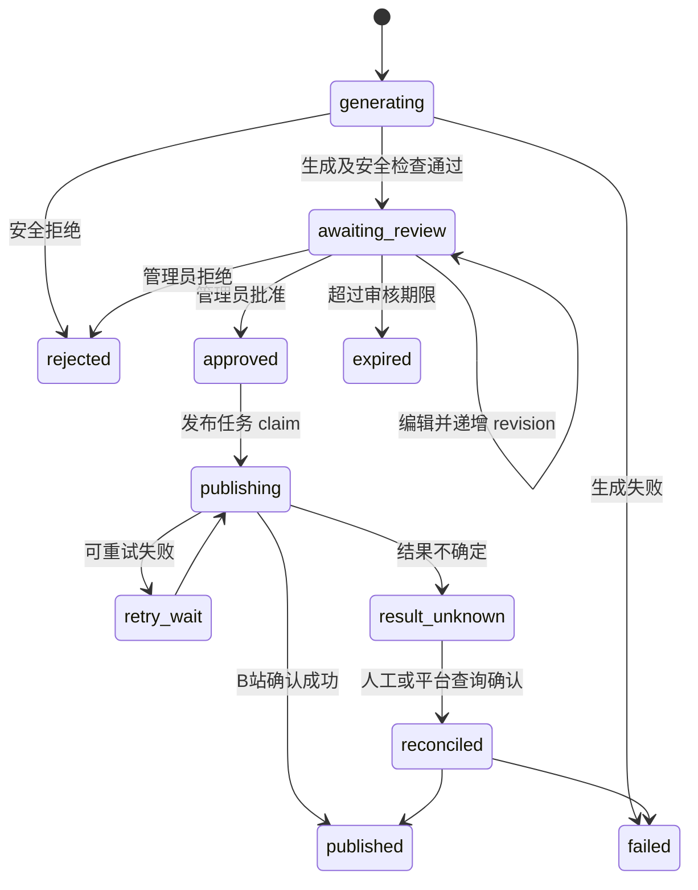
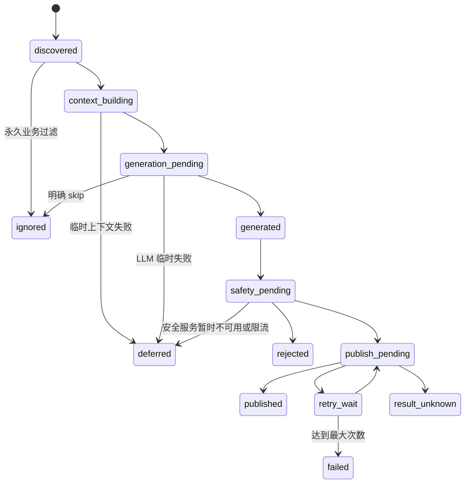

# PRD V5：BiliBot V4 实施缺口修复与上线闭环

> **版本**：V5.0  
> **日期**：2026-07-10  
> **状态**：待评审  
> **优先级**：P0  
> **前置文档**：`PRD-V4-全链路可靠性与多账号隔离闭环.md`  
> **适用范围**：`bilibot/` 当前 V2 多账号运行架构  
> **文档性质**：V4 实施后的缺口修复、上线门禁与验收基线  
> **冲突规则**：V5 只修正和补充 V4 已实施但未闭环的部分；与 V4 冲突时以 V5 为准，未涉及内容继续遵循 V4。

---

## 0. 文档目的

本 PRD 将 V4 实施后的代码审查结论转换为可开发、可测试、可验收的修复需求。它不是一般优化清单，重点解决以下风险：

1. 管理员明确开启审核后，动态仍未经批准直接发布。
2. 多账号配置、上下文、记忆、限流和登录会话仍可能串线或丢失。
3. 评论回复在临时失败后被永久忽略，发布失败后无法可靠重试原文。
4. 主动任务没有持久化生命周期，错过时间、失败或重启后无法恢复。
5. 视频分析缺少资源边界，可能再次造成整机高负载。
6. 私信可能绕过联网搜索禁用和脱敏策略，将私密内容发送给第三方。
7. 配置页面能保存不代表运行时真实生效，部分结构化配置还可能被破坏。

完成标准不是“新增了类、字段或 API”，而是实际入口、状态存储、前端、运行时消费者、迁移、审计和测试全部接通。

---

## 1. 背景与审查基线

### 1.1 当前已完成能力

V4 已正确落地以下方向，本 PRD 不要求推倒重写：

- 应用不再读取失效的 `AccountInstance.memory`。
- `SafetyChecker` 由 App 创建，不依赖 Web 是否开启。
- 账号启动改为后台任务，不再等待永久调度循环。
- 回复、主动评论、动态和周总结开始按账号解析人格。
- SQLite 记忆存储采用短连接，检索支持用户和人格硬过滤。
- Embedding 维度可动态推断，关闭前可 flush。
- 高风险互动动作默认关闭。
- 搜索结果从 system prompt 移到不可信 Reference Block。
- 已新增账号级二维码与账号级记忆 API。
- 动态和主动评论在安全检查异常时采用 fail-closed。

### 1.2 当前缺口总览

| 编号 | 严重度 | 问题 | 直接影响 |
|---|---:|---|---|
| DYN-501 | P0 | `review_before_publish=true` 仍直接发布 | 未审批内容对外发布 |
| ACC-501 | P0 | 禁用账号保存时丢失 | 账号和 Cookie 被配置更新删除 |
| SEA-501 | P0 | 私信按评论场景调用搜索 | 私信内容可能违规外发 |
| VID-501 | P0 | 收藏建议字段不一致 | 模型拒绝收藏仍可能收藏 |
| ACC-502 | P1 | 共享 ContextBuilder 绑定默认账号 | 非默认账号读取错误近期行为 |
| REP-501 | P1 | LLM 临时失败被标记 ignored | 评论永久漏回复 |
| REP-502 | P1 | retry_wait 未保存生成文本 | 无法可靠重发原回复 |
| MEM-501 | P1 | 同账号创建两套记忆引擎 | 缓存、连接和关闭生命周期分裂 |
| MEM-502 | P1 | 记忆前端仍调用根级旧 API | 查看、统计或删除错误数据库 |
| ACC-503 | P1 | 二维码新旧入口并存且会话未绑定管理员 | 写错账号或会话越权 |
| TASK-501 | P1 | 任务无持久化状态机 | 错过、失败和重启不可恢复 |
| COM-501 | P1 | 主动评论存在并发重复发布竞态 | 同视频可能发布两条评论 |
| VID-502 | P1 | 搜索上下文被视听分析覆盖 | 评价上下文丢失 |
| VID-503 | P1 | 视频资源边界与 Whisper 调用错误 | 阻塞、内存/CPU 过载 |
| CFG-501 | P1 | `profiles` 被通用数组控件字符串化 | 多人格配置损坏 |
| CFG-502 | P1 | revision 和热重载未真正闭环 | 并发覆盖、保存后不生效 |
| SAFE-501 | P1 | 限流未按账号隔离，内容检查开关未接线 | 账号互相抢额度或配置无效 |
| LLM-501 | P1 | 账号可绑定不存在的 Provider | 配置与实际模型不一致 |
| SEA-502 | P2 | 缓存、来源和连接管理不完整 | 成本、延迟和可解释性不足 |
| OBS-501 | P2 | audit draft 统计语义错误 | 失败记录被误当审核草稿 |

### 1.3 上线原则

- P0 未全部关闭：禁止连接真实生产账号执行任何自动发布。
- P1 未全部关闭：只允许单账号、低频、人工监控的灰度运行。
- 所有外部动作必须满足：账号明确、配置有效、状态已 claim、安全检查通过、额度可用、审计已创建。
- 所有临时失败必须进入可恢复状态，不能伪装成 ignored、triggered 或 succeeded。
- 所有前端配置项必须有明确消费者和生效级别。

---

## 2. 产品目标与成功指标

### 2.1 产品目标

1. 多账号运行时配置、上下文、人格、记忆、搜索预算、限流和登录会话完全隔离。
2. 回复、主动视频、主动评论和动态具备统一、持久化、可恢复的任务生命周期。
3. 管理员的审核、安全、搜索和动作开关在实际执行路径强制生效。
4. 视频理解在可配置资源边界内运行，不再导致系统不可用。
5. 配置中心能够无损编辑全部公开配置，并准确告知热生效或需重启。

### 2.2 可量化指标

| 指标 | 目标 |
|---|---:|
| 禁用账号在任意配置保存后保留率 | 100% |
| 跨账号上下文、记忆、Cookie 串线测试 | 0 次 |
| 审核开启时批准前动态发布调用数 | 0 |
| 相同幂等键重复外部发布数 | 0 |
| 可重试临时失败恢复成功率 | >= 99%，不含超过最大重试次数 |
| 任务状态与真实执行结果一致率 | 100% |
| 搜索场景策略和脱敏执行率 | 100% |
| 配置对象数组保存往返一致率 | 100% |
| 视频分析最大并发超过配置次数 | 0 |
| 自动化验收中真实联网/B站调用 | 0，全部使用 fake/mock |

### 2.3 非目标

- 不重写 B 站 API 客户端的全部接口。
- 不在本阶段增加新的社交平台。
- 不以扩大主动行为数量作为目标。
- 不保证 Custom Chat Completions 后端天然具备联网能力；它必须通过能力探测后才可标记为搜索后端。
- 不执行高负载真实视频回归作为日常 CI 的必要步骤。

---

## 3. 统一架构约束

### 3.1 账号运行时容器

每个 `AccountInstance` 必须唯一持有以下账号级依赖：

```text
AccountInstance
  account_id
  account_config_snapshot
  data_store
  bili_client
  llm_provider
  active_persona_resolver
  context_builder
  knowledge_memory
  web_search_service
  interaction_policy
  scheduler
```

App 层只允许共享无账号可变状态的服务，例如 Provider 注册表、人格定义库和全局监督器。任何依赖账号数据目录、账号凭据、账号额度或账号最近行为的对象不得作为跨账号单例。

### 3.2 强制调用上下文

所有链路内部统一传递：

```json
{
  "account_id": "main",
  "persona_id": "tech",
  "scene": "reply_comment",
  "task_id": "uuid",
  "actor": "scheduler|admin",
  "correlation_id": "uuid"
}
```

缺少 `account_id` 的外部动作请求必须返回 `400`；账号不存在返回 `404`；不得回退默认账号执行写操作。

### 3.3 外部动作执行顺序


平台调用之前必须完成持久化 claim。平台调用成功但本地结果未知时进入 `result_unknown`，不得直接重新执行。

---

## 4. P0 修复

### 4.1 DYN-501 动态审核强制生效

#### 现状

`dynamic_publish.review_before_publish` 已出现在配置和加载器中，但 `_do_post_dynamic()` 无审核分支，内容通过安全检查后直接调用 `post_dynamic_text()`。

#### 目标行为

- `review_before_publish=false`：按自动发布流程执行。
- `review_before_publish=true`：生成内容和可选图片后写入草稿，状态为 `awaiting_review`，不得调用任何 B 站发布或上传接口。
- 管理员批准后由独立发布任务执行一次。
- 拒绝、过期或撤销的草稿永不发布。
- 编辑草稿后必须重新执行安全检查，并产生新 revision。

#### 草稿状态机



#### 数据模型 `dynamic_drafts`

| 字段 | 类型 | 约束 |
|---|---|---|
| `draft_id` | TEXT | PK, UUID |
| `account_id` | TEXT | NOT NULL |
| `persona_id` | TEXT | NOT NULL |
| `task_id` | TEXT | NOT NULL, UNIQUE |
| `content` | TEXT | NOT NULL |
| `image_refs_json` | TEXT | 默认 `[]` |
| `status` | TEXT | 状态枚举 |
| `revision` | INTEGER | 从 1 开始 |
| `safety_snapshot_json` | TEXT | 审核依据 |
| `created_by` | TEXT | scheduler/admin |
| `reviewed_by_session_hash` | TEXT | 可空 |
| `review_note` | TEXT | 可空 |
| `expires_at` | REAL | 可空 |
| `created_at/updated_at` | REAL | NOT NULL |

唯一约束：`(account_id, task_id)`。批准接口必须使用 `draft_id + expected_revision` 做并发控制。

#### API

| 方法 | 路径 | 说明 |
|---|---|---|
| GET | `/api/accounts/{account_id}/dynamic-drafts` | 按状态分页查询 |
| GET | `/api/accounts/{account_id}/dynamic-drafts/{draft_id}` | 草稿详情 |
| PATCH | `/api/accounts/{account_id}/dynamic-drafts/{draft_id}` | 编辑，要求 expected_revision |
| POST | `/api/accounts/{account_id}/dynamic-drafts/{draft_id}/approve` | 批准并创建发布任务 |
| POST | `/api/accounts/{account_id}/dynamic-drafts/{draft_id}/reject` | 拒绝 |
| POST | `/api/accounts/{account_id}/dynamic-drafts/{draft_id}/retry` | 对可重试失败重新排队 |

#### 验收标准

- 开启审核后，生成草稿期间 `post_dynamic_text` 和图片上传调用均为 0。
- 同一 revision 连续批准两次，只产生一个发布 TaskRun 和最多一次平台发布。
- 拒绝、过期草稿在任何重启场景下均不会发布。
- UI 能区分待审核、发布中、失败、结果未知和已发布。

### 4.2 ACC-501 禁用账号配置零丢失

#### 现状

`AccountManager.initialize()` 跳过禁用账号，`save_to_config()` 只序列化运行时实例。保存其他账号时会删除禁用账号及凭据。

#### 需求

- 分离 `AccountConfigRegistry` 与 `AccountRuntimeRegistry`。
- 配置注册表加载所有合法账号，包括禁用和初始化失败账号。
- 运行时注册表只创建 `enabled=true` 且校验通过的实例。
- 保存时以配置注册表为事实来源，按 ID 局部更新，不得从运行实例反向重建整个数组。
- 删除账号必须是显式 DELETE 操作，并写安全审计。
- 对账号 Cookie 等敏感字段使用保留占位符规则，PATCH 未提交时保留原值。

#### 验收标准

- 启用账号、禁用账号、初始化失败账号混合存在时，任意账号 PATCH 后三者均保留。
- 禁用账号 Cookie 的字节值保持不变。
- 禁用账号可在 UI 中重新启用；不需手工编辑 YAML。

### 4.3 SEA-501 私信搜索隐私边界

#### 现状

私信复用 `ReplyGenerator`，搜索场景固定为 `reply_comment`，可能绕过 `private_message.enabled=false` 和私信脱敏。

#### 需求

- `ReplyGenerator.generate_reply()` 必须接收强类型 `scene`，不得内部写死。
- 私信调用必须传 `private_message`。
- 搜索服务入口再次检查场景开关，形成双重防线。
- 私信搜索默认关闭。开启时必须同时开启 `redact_query=true`，否则配置校验失败。
- 脱敏至少覆盖 UID、手机号、邮箱、Cookie、URL query token、订单号和连续长数字。
- 日志和 audit 只记录查询 hash、脱敏后预览及字段类型，不记录原始私信。
- 第三方后端调用前记录 `external_data_disclosure` 审计。

#### 验收标准

- 默认配置下私信包含“最新新闻”也不会触发搜索。
- 开启私信搜索后，mock 后端收到的只能是脱敏文本。
- 评论搜索行为不受私信开关影响。

### 4.4 VID-501 互动意图字段契约

#### 现状

视频评价输出 `want_fav`，策略层读取语义不一致的收藏字段；字段缺失时还可能按评分阈值批准收藏。

#### 需求

- 定义唯一 `InteractionSuggestion` DTO：

```json
{
  "want_like": false,
  "want_coin": false,
  "want_favorite": false,
  "want_comment": false,
  "score": 0,
  "reason": ""
}
```

- `want_fav` 只允许在迁移适配器读取，立即转换为 `want_favorite`，新代码不得继续产生旧字段。
- 字段缺失、类型非法、LLM 解析失败一律视为 `false`。
- 分数阈值只能进一步拒绝模型建议，不能把 `false` 提升为 `true`。
- 点赞、投币、收藏、评论分别有独立开关、日预算、单视频上限和账号级去重。

#### 验收标准

- `want_favorite=false, score=10` 时收藏调用数为 0。
- 缺少任一动作字段时对应动作调用数为 0。
- 四类动作契约测试覆盖 true、false、缺失、字符串、LLM 异常五类输入。

---

## 5. 多账号、多人格与登录

### 5.1 ACC-502 账号级 ContextBuilder

每个账号创建独立 `ContextBuilder`，注入该账号的 `DataStore`、`UserState`、`BiliClient`、`KnowledgeMemory` 和只读人格解析器。禁止 App 在初始化后把共享 ContextBuilder 回填为默认账号依赖。

`build()` 必须校验传入 `account_id` 与实例账号一致，不一致时抛出隔离异常并停止生成。最近主动行为只能从本账号数据目录读取。

验收：两个账号分别写入可识别的 recent action，交叉构建 100 次，上下文中不出现另一账号内容。

### 5.2 ACC-503 二维码登录会话闭环

#### 会话模型

```json
{
  "qr_session_id": "uuid",
  "account_id": "main",
  "creator_session_hash": "sha256(admin-token)",
  "qrcode_key_hash": "sha256(key)",
  "status": "created|scanned|confirmed|expired|cancelled",
  "expire_at": 0,
  "created_at": 0
}
```

要求：

- 创建、轮询、取消必须由同一管理员会话执行；不返回原始 key 和 Cookie。
- 会话一次性、180 秒过期、确认后立即失效。
- 新二维码必须从目标账号卡片发起，卡片明确显示账号名与 UID。
- 概览页若未明确选择账号，只能跳转账号页，不得猜测默认账号。
- 删除旧 `/api/bilibili/qrcode/*` 写入口；如需过渡，只返回 `410 Gone` 和新路径说明。
- 账号不存在或已删除时不得回退 V1 配置。
- Cookie 写入成功后只重载目标账号。

验收覆盖：错账号轮询、错管理员轮询、过期、重复确认、账号删除、旧端点调用和日志脱敏。

### 5.3 LLM-501 Provider 绑定校验

- 新增或更新账号时，`llm_id` 必须为空或指向存在且启用的 Provider。
- 删除 Provider 前检查引用账号；默认行为为拒绝，并返回引用列表。
- 状态接口返回 `configured_llm_id`、`effective_llm_id` 和 `fallback_reason`。
- 生产模式禁止静默回退；只有显式 `allow_llm_fallback=true` 才允许回退。

### 5.4 多人格解析规则

保持 `profile_id > persona_id > profile.default_persona > system.default_persona` 的解析顺序，但增加以下约束：

- 每次生成开始时解析一次并冻结 `persona_id` 到 TaskRun。
- 任务执行中切换人格不改变该任务已有输出和记忆归属。
- 保存 profile 前校验所有 persona ID 存在且启用。
- 删除人格前检查 profile 和账号引用。

需要明确：人格本身不登录 B 站，也不持有 Cookie。登录主体永远是 `AccountInstance`；绑定关系是 `B站账号 -> Profile/Persona -> LLM Provider`。同一 Persona 可以被多个账号引用，但每个账号仍使用自己的 Cookie、数据目录、任务、额度和记忆。UI 不得使用“人格登录 B站号”等容易误解的表述。

---

## 6. 回复与私信可靠性

### 6.1 REP-501 可判别的生成结果

禁止再用 `None` 同时表示“不想回复”和“临时失败”。定义：

```python
GenerationOutcome(
    status="generated|skip|retryable_error|permanent_error",
    text="",
    error_code="",
    retry_after=None,
    audit_id=None,
    context_meta={},
)
```

分类规则：

| 情况 | outcome | 回复状态 |
|---|---|---|
| 业务过滤或模型显式输出 skip | `skip` | `ignored` |
| LLM 超时、429、5xx、连接错误 | `retryable_error` | `deferred` |
| 搜索失败但可降级 | 继续无搜索生成 | 不终止 |
| 安全策略永久拒绝 | `permanent_error` | `rejected` |
| 解析失败且重试可能恢复 | `retryable_error` | `deferred` |
| 生成有效文本 | `generated` | `safety_pending` |

`ReplyGenerator` 不得吞异常后返回 `None`。捕获异常时必须转换为带错误码的 Outcome，未知异常默认为可重试且受最大次数限制。

### 6.2 REP-502 生成文本持久化与重发

- 获得有效文本后，进入安全检查前就写入 `generation_result`、内容 hash、persona ID 和 prompt/audit 引用。
- `publish_pending`、`retry_wait`、`published` 都必须保留相同生成文本 hash。
- 发布失败重试直接使用原文本，不重新生成。
- 只有显式管理员操作或安全策略变化导致文本失效时，才允许创建新 generation revision。
- 每次发布使用幂等键：`account_id + comment_type + source_rpid + generation_revision`。

### 6.3 回复状态机



中间状态超时恢复：启动时将超过租约的 `context_building/generation_pending/safety_pending` 转为 `deferred`；`publish_pending` 转为 `result_unknown`，先对账而不是盲目重发。

### 6.4 PM-501 私信独立幂等状态

- 私信幂等键使用平台消息 ID，不得用 `talker_id + 内容前 50 字`。
- 私信生成传入 `scene=private_message`。
- 私信发布失败支持独立退避和最大次数。
- 任何私信原文不得进入全局记忆或另一账号数据目录。

---

## 7. 统一任务与调度系统

### 7.1 TASK-501 TaskRun 数据模型

新增账号级或共享但强制带账号字段的 `task_runs` 表：

| 字段 | 类型 | 说明 |
|---|---|---|
| `task_id` | TEXT PK | UUID |
| `account_id` | TEXT NOT NULL | 账号 |
| `scene` | TEXT NOT NULL | proactive_video/dynamic/weekly 等 |
| `idempotency_key` | TEXT NOT NULL UNIQUE | 业务幂等键 |
| `trigger_type` | TEXT | schedule/manual/retry/recovery |
| `status` | TEXT | 状态枚举 |
| `scheduled_at` | REAL | 原计划时间 |
| `not_before` | REAL | 最早执行时间 |
| `lease_until` | REAL | 运行租约 |
| `attempt` / `max_attempts` | INTEGER | 重试 |
| `next_retry_at` | REAL | 退避 |
| `input_json` / `result_json` | TEXT | 脱敏快照 |
| `last_error_code` / `last_error` | TEXT | 失败摘要 |
| `created_at/started_at/finished_at/updated_at` | REAL | 时间 |

状态：`scheduled -> claimed -> running -> succeeded`；失败进入 `retry_wait` 或 `failed`；超出晚到窗口进入 `expired`；重启时 `claimed/running` 转 `interrupted` 后按场景恢复；平台结果不确定进入 `result_unknown`。

### 7.2 晚到、失败与重启恢复

- 默认晚到窗口 15 分钟，可按 scene 配置。
- `scheduled_at <= now <= scheduled_at + grace_window` 的任务仍可 claim。
- 超窗只写 `expired`，不得伪装 `triggered`。
- 只有 `succeeded` 才算当天任务完成。
- 创建协程不等于成功，不得提前写 triggered。
- 当天计划持久化后，重启不得重新随机生成同日计划。
- 次日生成计划前清空内存数组；次数为 0 时持久化空计划。

### 7.3 并发锁与 claim

- 同账号同 scene 默认并发 1。
- 主动评论额外使用 `account_id + bvid + comment` 唯一 claim。
- 动态批准发布使用 `account_id + draft_id + revision` 唯一 claim。
- SQLite claim 必须通过事务条件更新或唯一约束完成，不能使用“先查再写”。
- 进程内锁只作为性能优化，不作为唯一正确性保障。

### 7.4 手动任务 API

| 方法 | 路径 | 行为 |
|---|---|---|
| POST | `/api/accounts/{account_id}/tasks/proactive-video` | 立即返回 202 + task_id |
| POST | `/api/accounts/{account_id}/tasks/dynamic` | 立即返回 202 + task_id |
| GET | `/api/accounts/{account_id}/tasks/{task_id}` | 查询状态和脱敏结果 |
| POST | `/api/accounts/{account_id}/tasks/{task_id}/cancel` | 取消尚未外部发布的任务 |
| POST | `/api/accounts/{account_id}/tasks/{task_id}/retry` | 对允许状态重试 |

旧默认账号任务入口返回 `410 Gone`，不得隐式选择默认账号。

### 7.5 调度 UI

页面展示 TaskRun 和真实持久化计划，不再读取废弃的 `video_times/dynamic_times`。至少显示账号、scene、计划时间、状态、attempt、最近错误和下一次重试时间。

---

## 8. 主动视频和主动评论

### 8.1 VID-502 搜索与视听上下文合并

禁止复用单个 `video_content` 字符串反复覆盖。定义结构化上下文：

```json
{
  "metadata": {},
  "hot_comments": [],
  "search_reference": {"answer": "", "items": []},
  "audiovisual": {"behavior_log": "", "complete": false},
  "degradation_reasons": []
}
```

- 搜索、元数据、热评和视听结果分别赋值。
- 某一路失败不得清空其他成功结果。
- Prompt Builder 统一截断并标记来源，不使用字符串覆盖。
- 搜索结果始终是不可信 Reference Block。

### 8.2 VID-503 视频资源保护

#### 配置

```yaml
video_analysis:
  enabled: false
  max_duration_seconds: 600
  max_download_bytes: 209715200
  max_concurrent_global: 1
  max_concurrent_per_account: 1
  download_timeout_seconds: 90
  preprocess_timeout_seconds: 180
  analysis_timeout_seconds: 600
  local_whisper_enabled: false
  max_local_whisper_workers: 1
  temp_disk_quota_bytes: 1073741824
```

#### 运行要求

- 下载前先读取视频时长和候选流大小；超限直接降级元数据分析。
- 下载过程中计算实际字节数，超过上限立即中止并清理临时文件。
- `preprocess_video`、ffprobe、ffmpeg、Katna、SceneDetect 等同步工作必须进入受控线程/进程执行器。
- 修复 `_transcribe_with_whisper(audio_path, ...)` 参数。
- 本地 Whisper 默认关闭；开启时使用独立工作池和超时。
- App 级全局 semaphore 限制所有账号总并发。
- 关闭时停止接收新任务、取消可取消子进程并清理临时目录。
- TaskRun 记录降级原因，不因视频分析失败阻断无副作用的元数据评价。

#### 验收标准

- 超时长、超大小、磁盘配额不足时不开始完整下载或分析。
- 两账号同时触发时实际分析并发不超过全局配置。
- fake subprocess 超时后事件循环仍能处理轻量任务。
- 本地 Whisper 单元测试验证 `audio_path` 被正确传递。

### 8.3 COM-501 主动评论原子幂等

流程必须改为：创建/claim 动作记录 -> 生成文本 -> 策略检查 -> 发布 -> 写真实结果。动作表至少包含 `claimed/publishing/published/retry_wait/result_unknown/failed`。

同账号同视频最多一条成功主动评论。定时与手动任务并发只能有一个 claim 成功。平台调用成功、本地写入失败时进入 `result_unknown`，不得自动再次发布。

### 8.4 主动互动安全

- 四类动作分别按账号限额，禁止共享 App 级 scene 桶。
- 失败尝试是否占额度必须配置明确；默认高风险动作的失败尝试占短时额度，避免持续撞风控。
- B 站风险码触发账号级暂停，不暂停无关账号。
- 所有策略输入和最终决策写审计，但不记录 Cookie 或完整外部响应。

---

## 9. 记忆系统

### 9.1 MEM-501 每账号单实例

`AccountInstance` 是 `KnowledgeBaseMemory` 唯一所有者。Scheduler 构造函数必须接收已初始化实例，不得自行创建。ReplyGenerator、CommentContext、主动行为和关闭流程使用同一对象。

要求：

- 初始化一次、关闭一次、flush 一次。
- 所有异步写入由有界 `MemoryWriteQueue` 进入同一服务。
- 队列包含幂等键、最大长度、退避、死信和停机排空。
- 禁止业务代码直接 import `memory_writer` 绕过服务。

### 9.2 MEM-502 账号化前端与 DTO

- Dashboard 和 Living Memory 进入时必须选择或携带 `account_id`。
- 全部切换到 `/api/accounts/{account_id}/memory/*`。
- 统一字段为 `category`、`by_category`，不得继续混用 `type/by_type`。
- 删除、迁移、检索和图谱查询都需要账号路径参数。
- 根级 `/api/memory/*` 过渡期只允许读取明确配置的默认账号并返回 deprecation header；写操作返回 `410`。最终删除。
- 不存在或禁用账号的记忆仍可由管理员只读查看，但必须从配置注册表解析数据目录，不能要求运行实例存在。

### 9.3 记忆配置接线

`max_today/max_recent/max_long_term/enable_forgetting/forgetting_score` 等字段必须有实际消费者。为每个配置建立 `schema_path -> owner -> reload_level -> test_id` 映射。未消费字段不得在正式配置页宣称可用。

---

## 10. 联网搜索

### 10.1 SEA-502 服务生命周期

- Scheduler 创建搜索服务时传入 `account_id`。
- 初始化调用 `_load_cache()`；持久化缓存按账号隔离。
- 提供共享长连接 Session，并在账号关闭时关闭。
- 同账号、同后端、同 query、同 freshness 的并发请求合并为一个 in-flight 请求。
- 429/5xx/网络错误使用带抖动指数退避，且受 TaskRun 超时控制。
- 日预算持久化，重启后不得清零；预算键包含账号和日期。

### 10.2 结构化来源

统一结果：

```json
{
  "answer": "",
  "items": [{"title": "", "snippet": "", "url": ""}],
  "citations": [{"url": "", "title": ""}],
  "backend": "tavily",
  "query_hash": "",
  "freshness": "daily",
  "cached": false
}
```

Perplexity 必须保留 citations。Custom 后端必须通过能力探测或显式 `supports_web_search=true` 才可用；普通 Chat Completions 不得被标记为已联网。

### 10.3 搜索调用矩阵

| 场景 | 默认 | 是否允许 LLM 判定 | 隐私要求 |
|---|---:|---:|---|
| 评论回复 | 开 | 是，规则预筛后 | 普通脱敏 |
| 私信 | 关 | 仅显式开启后 | 强制脱敏 |
| 主动视频 | 开 | 是 | 仅视频公开信息 |
| 动态 | 关 | 是 | 不包含记忆原文 |
| 周总结 | 关 | 否，默认使用本地数据 | 不外发用户信息 |

---

## 11. 配置中心

### 11.1 CFG-501 结构化数组编辑

`profiles`、`accounts`、`llm_providers` 和其他对象数组不得使用逗号文本框。选择以下之一：

1. 专用结构化编辑器，支持增删排序、字段校验和引用选择。
2. 从通用配置页移除，在专用账号/人格/Provider 页面管理。

保存前后执行深度结构校验。对象数组不得接受字符串数组；后端遇到错误类型返回 400，不得尝试猜测转换。

### 11.2 CFG-502 乐观锁

- GET `/api/config/full` 返回 `config_revision`。
- UI 保存该 revision，PATCH 时发送 `_expected_revision`。
- 409 时保留本地未提交内容，展示“远端已更新”，允许刷新或重新应用差异。
- 成功保存后用响应中的新 revision 更新本地状态。
- 所有专用配置 API 同样递增统一 revision，避免绕过并发控制。

### 11.3 热重载契约

每个配置项声明：`immediate`、`next_task`、`restart_account` 或 `restart_app`。

| 配置类别 | 生效级别 | 必须调用的消费者 |
|---|---|---|
| 回复、搜索场景和安全阈值 | immediate | ReplyGenerator/WebSearch/Safety |
| 互动策略和预算 | immediate | PolicyEngine/CommentPolicy |
| 每日次数和排期 | next_task | Scheduler 重建未来 TaskRun |
| 视频分析参数 | next_task | VideoUnderstandingService |
| 账号 Cookie | immediate | 仅目标 BiliClient |
| 账号 LLM/persona/profile | restart_account 或原子切换 | AccountInstance |
| 数据目录、监听地址 | restart_app | App |

保存响应必须返回每个变更字段的实际生效状态，禁止笼统返回“已热重载”。

### 11.4 SAFE-501 安全配置接线

- `content_check_enabled=false` 时仅跳过可选内容规则，不得跳过全局暂停、账号风险暂停和硬性长度/平台限制；具体规则在 UI 中明确。
- Safety 服务提供 `reload_config()`。
- 限流键至少为 `account_id + scene`，同时可配置全局总额度。
- 最近内容重复度存储按账号隔离。
- Scheduler 调用安全方法时必须显式传 `account_id`。

### 11.5 配置完整性自动检查

CI 自动生成并比较：

- 示例 YAML 的公开字段集合。
- 配置 schema 字段集合。
- 代码消费者声明集合。
- UI 专用配置 API 字段集合。

允许内部字段和废弃字段进入白名单；其他“示例存在但 UI 不可配置”“UI 存在但无人消费”均使测试失败。

### 11.6 配置中心覆盖清单

配置可以位于通用配置页或明确的专用页面，但每个公开字段必须有唯一管理入口、校验器、消费者和生效级别。以下配置段不得遗漏：

| 配置段 | 必须覆盖的内容 | 推荐入口 |
|---|---|---|
| `accounts/default_account` | 凭据、启用、Profile、Persona、LLM、登录状态 | 账号专页 |
| `llm_providers/default_llm` | Provider CRUD、能力、默认项、引用检查 | Provider 专页 |
| `profiles` | 对象数组、默认人格、可用人格和引用完整性 | 人格组专页 |
| `features` | 回复、私信、主动视频、主动评论、动态、周总结 | 通用配置页 |
| `reply` | 过滤、批量、重试次数、退避、回复自己 | 通用配置页 |
| `proactive` | 每日次数、筛选策略、晚到窗口和排期策略 | 调度专页 |
| `interactions` | 点赞、投币、收藏、评论的开关、阈值和额度 | 策略专页 |
| `dynamic_publish` | 主题、审核、草稿过期、配图失败策略 | 动态专页 |
| `image_generation` | Provider、模型、尺寸、超时、密钥 | 文生图专页 |
| `video_analysis` | 下载边界、并发、抽帧、ASR、Whisper、临时目录 | 视频分析专页 |
| `web_search` | 后端、场景、脱敏、缓存、预算、熔断 | 搜索专页 |
| `memory` | 容量、遗忘、检索、Embedding、队列和 flush | 记忆专页 |
| `safety` | 内容规则、账号/全局额度、暂停和重复度 | 安全专页 |
| `web/logging/data_dir` | 鉴权、会话、CORS、日志和重启要求 | 系统专页 |

同一字段不得在两个页面独立保存。专用 API 也必须参与统一 `config_revision`，并返回应用结果。

---

## 12. API 响应和错误规范

统一错误结构：

```json
{
  "success": false,
  "error": {
    "code": "TASK_ALREADY_RUNNING",
    "message": "该账号的主动视频任务正在运行",
    "retryable": false,
    "details": {"task_id": "..."}
  },
  "correlation_id": "..."
}
```

关键错误码：

| 错误码 | HTTP | 含义 |
|---|---:|---|
| `ACCOUNT_NOT_FOUND` | 404 | 账号不存在 |
| `ACCOUNT_DISABLED` | 409 | 账号已禁用且操作不允许 |
| `LLM_PROVIDER_NOT_FOUND` | 400 | Provider 无效 |
| `CONFIG_REVISION_CONFLICT` | 409 | 配置并发冲突 |
| `TASK_ALREADY_RUNNING` | 409 | 并发 claim 冲突 |
| `DRAFT_REVISION_CONFLICT` | 409 | 草稿已被修改 |
| `QR_SESSION_OWNER_MISMATCH` | 403 | 管理员会话不匹配 |
| `SEARCH_SCENE_DISABLED` | 403 | 场景禁止搜索 |
| `RESOURCE_LIMIT_EXCEEDED` | 422 | 视频资源超限并降级 |
| `PUBLISH_RESULT_UNKNOWN` | 202 | 平台结果待对账 |

---

## 13. 审计、指标与可观测性

### 13.1 OBS-501 明确审核与生成审计

AuditStore 不得用 `total - published` 计算 draft。生成审计和业务草稿是不同实体。

统计至少分别返回：

- generated
- awaiting_review
- approved
- rejected
- publishing
- published
- retry_wait
- result_unknown
- failed
- expired

### 13.2 统一日志字段

所有任务日志包含：`account_id`、`persona_id`、`scene`、`task_id`、`correlation_id`、`attempt`。不得记录 Cookie、二维码 key、原始私信、完整搜索查询或 API Key。

### 13.3 指标

- `task_runs_total{account_id,scene,status}`
- `publish_attempts_total{account_id,scene,result}`
- `reply_deferred_total{reason}`
- `search_requests_total{account_id,scene,backend,result,cached}`
- `video_analysis_seconds{stage}`
- `video_analysis_active`
- `memory_write_queue_depth{account_id}`
- `config_reload_total{component,result}`
- `cross_account_guard_rejections_total`

### 13.4 账号级运行状态

废弃只反映 V1 根级 `bilibili/llm/current_persona` 的管理状态。新增或扩展账号状态 API，至少返回：

```json
{
  "account_id": "main",
  "enabled": true,
  "runtime_state": "running|stopped|configuration_error|degraded",
  "authenticated": true,
  "uid": "123",
  "configured_persona_id": "tech",
  "effective_persona_id": "tech",
  "configured_llm_id": "primary",
  "effective_llm_id": "primary",
  "scheduler": {"running": true, "next_task_at": 0},
  "memory": {"available": true, "queue_depth": 0},
  "search": {"available": false, "budget_remaining": 100},
  "config_revision": 12,
  "last_error": null
}
```

Dashboard 总览只能汇总账号级状态；账号扫码、任务、记忆和策略入口必须从选定账号状态发起。单个账号状态读取失败不得拖垮整个状态接口，且响应不得包含 Cookie 或 API Key。

---

## 14. 迁移与兼容

### 14.1 数据迁移

1. 创建 `task_runs`、`dynamic_drafts` 和统一动作 claim 表。
2. 保留现有 reply state，并增加 generation revision、hash、lease 和 result_unknown 状态。
3. 将现有账号配置加载到 `AccountConfigRegistry`，不改变顺序和敏感值。
4. 记忆只保留每账号一套实例；数据库格式不变时无需搬迁数据。
5. 搜索缓存和预算迁移到账号目录。

### 14.2 API 兼容

- 所有可能写默认账号的旧端点立即返回 `410`。
- 只读旧端点可保留一个版本，并返回 `Deprecation` 和 `Sunset` header。
- 前端与后端必须在同一发布版本完成账号化切换。

### 14.3 配置迁移

- `want_fav` 仅作为模型输出兼容别名，不作为配置字段。
- `features.web_search` 迁移到 `web_search.enabled` 后删除旧消费者。
- `reply.auto_reply` 迁移到 `features.reply_comment` 后只读兼容一个版本。
- 迁移必须使用临时文件、fsync、原子替换，并生成脱敏备份。

---

## 15. 测试策略

### 15.1 轻量测试原则

默认 CI 禁止真实 B 站请求、真实搜索、视频下载和本地 Whisper。所有链路使用 fake client、临时 SQLite 和小型固定媒体 fixture。重型媒体测试放入独立手动 job，并设置硬超时和资源上限。

### 15.2 必需单元测试

- 禁用账号保存保留及敏感字段不变。
- GenerationOutcome 四类结果映射。
- retry_wait 保存并重发原 generation_result。
- InteractionSuggestion 字段契约，特别是收藏 false 不升级。
- TaskRun 状态转换、租约、退避和唯一 claim。
- 草稿 revision、批准幂等、拒绝和过期。
- ContextBuilder 跨账号隔离。
- Memory 单实例注入和关闭一次。
- 搜索场景矩阵、私信脱敏、缓存读取和预算持久化。
- 配置对象数组 round-trip、revision 409 和 reload contract。
- Whisper 参数和视频资源上限。

### 15.3 必需集成测试

| 场景 | 预期 |
|---|---|
| 两账号同时回复 | 人格、上下文、记忆、限流互不污染 |
| LLM 超时后恢复 | 先 deferred，后生成并只发布一次 |
| 发布成功后本地写入模拟中断 | result_unknown，不自动重发 |
| 动态审核开启 | 批准前平台调用 0，批准后恰好 1 |
| 定时与手动同时评论同视频 | 只有一个 claim 和一次发布 |
| 计划晚到 10 分钟 | 窗口内执行一次 |
| 计划晚到超过窗口 | expired，不执行 |
| 任务运行中重启 | interrupted 后按策略恢复 |
| 两管理员同时保存配置 | 一个成功，一个 409 |
| 两管理员交叉轮询二维码 | 非创建者得到 403 |
| 私信搜索默认配置 | 第三方搜索调用 0 |
| 大视频/慢 subprocess | 降级或超时，主事件循环可响应 |

### 15.4 测试基础设施要求

- `pytest-asyncio` 必须在开发和 CI 环境安装，并启用严格模式。
- 未识别 `pytest.mark.asyncio` 时 CI 直接失败，不允许把异步用例静默跳过。
- 新增测试覆盖：ReplyStateStore、InteractionPolicy、WebSearchService、账号二维码、账号记忆 API、TaskRun、动态草稿、禁用账号保留。

---

## 16. 实施计划

### Phase 0：立即阻断错误外部动作

- DYN-501 动态审核强制生效。
- ACC-501 禁用账号不丢失。
- SEA-501 私信搜索隐私边界。
- VID-501 收藏字段契约。
- 临时措施：未完成前将动态、私信搜索、收藏默认强制关闭。

### Phase 1：账号隔离与登录

- ACC-502 账号级 ContextBuilder。
- ACC-503 二维码会话及旧端点下线。
- LLM-501 Provider 校验。
- SAFE-501 账号级安全桶。

### Phase 2：回复与任务可靠性

- REP-501/502 GenerationOutcome 和原文重试。
- TASK-501 TaskRun、晚到窗口、重启恢复和手动 API。
- COM-501 主动评论原子 claim。

### Phase 3：记忆与前端接线

- MEM-501 单实例和写入队列。
- MEM-502 Dashboard/Living Memory 账号化。
- 配置到消费者映射。

### Phase 4：视频、搜索与配置中心

- VID-502/503 上下文合并及资源保护。
- SEA-502 搜索生命周期和 citations。
- CFG-501/502 结构化编辑、revision 和热重载契约。

### Phase 5：迁移、灰度和清理

- 下线旧写 API 和旧配置消费者。
- 完成指标、告警、故障演练与回滚验证。
- 单账号观察 72 小时后再开启第二账号。

---

## 17. 回滚方案

- 数据库迁移必须向前兼容旧读取，回滚不得删除新表。
- 每个 Phase 可用功能开关独立关闭，但安全、账号隔离和幂等保护不可关闭。
- 发布异常时依次关闭：动态 -> 主动评论 -> 高风险互动 -> 自动回复；保留只读监控和管理 API。
- 若 TaskRun 执行器异常，停止 claim 新任务，保留队列等待修复，不退回旧布尔调度。
- 若配置迁移失败，恢复原子备份并保持所有外部动作暂停。

---

## 18. Definition of Done

以下条件全部满足才可宣告 V5 完成：

- [ ] 四项 P0 全部有自动化回归测试并关闭。
- [ ] 禁用、无凭据和初始化失败账号均不会因保存丢失。
- [ ] 所有外部写操作显式要求 account_id，无默认账号回退。
- [ ] 两账号上下文、记忆、搜索预算和限流隔离测试通过。
- [ ] 回复临时失败不会进入 ignored，发布重试使用原生成文本。
- [ ] 主动视频、评论和动态全部进入持久化 TaskRun。
- [ ] 动态审核开启时批准前零平台调用。
- [ ] 视频分析受时长、大小、并发、超时和磁盘配额保护。
- [ ] 私信搜索默认关闭，开启时强制脱敏。
- [ ] 记忆前端全部使用账号化 API，DTO 字段一致。
- [ ] `profiles` 等对象数组可无损往返保存。
- [ ] 配置 revision 在 UI 生效，热重载结果按组件返回。
- [ ] 旧二维码和旧任务写入口已返回 410 或删除。
- [ ] 异步测试插件在 CI 有效，所有 asyncio 用例真实执行。
- [ ] 无真实 B 站账号、搜索 API 或大视频参与默认 CI。

---

## 19. 需求追踪矩阵

| 审查问题 | 需求编号 | 主要模块 | 核心验收 |
|---|---|---|---|
| 审核开启仍发动态 | DYN-501 | scheduler、draft API、UI | 批准前调用 0 |
| 禁用账号保存丢失 | ACC-501 | account manager/config | round-trip 保留 |
| 私信绕过搜索策略 | SEA-501 | reply/search/scheduler | 默认调用 0、开启后脱敏 |
| 收藏字段错位 | VID-501 | evaluator/policy | false 时调用 0 |
| 默认账号上下文串线 | ACC-502 | app/account/context | 双账号交叉 0 污染 |
| 临时失败永久忽略 | REP-501 | reply/scheduler/state | deferred 后恢复 |
| 重试无生成文本 | REP-502 | scheduler/reply state | 原 hash 重发 |
| 两套记忆实例 | MEM-501 | account/scheduler/memory | 每账号构造和关闭各 1 次 |
| 记忆 UI 错库 | MEM-502 | memory API/dashboard | 路径含 account_id |
| 二维码会话不完整 | ACC-503 | accounts/panel/dashboard | owner/账号/过期校验 |
| 任务晚到和失败丢失 | TASK-501 | scheduler/tasks/store | 状态可恢复 |
| 后台协程创建后立即标记 triggered | TASK-501 | scheduler/task store | 只有 succeeded 计完成 |
| 每日次数归零后保留旧计划 | TASK-501 | scheduler/config reload | 次数为 0 时计划为空 |
| 主动评论重复竞态 | COM-501 | scheduler/policy/task | 并发只发 1 次 |
| 搜索被视听覆盖 | VID-502 | scheduler/prompt | 两来源同时存在 |
| 视频拖垮机器 | VID-503 | downloader/video service | 资源上限生效 |
| profile 被字符串化 | CFG-501 | config API/dashboard | 深度相等 |
| revision/热重载无效 | CFG-502 | config/account/components | 409 和生效报告 |
| 安全桶串账号 | SAFE-501 | safety/scheduler | 账号额度独立 |
| 无效 LLM 静默回退 | LLM-501 | accounts/llm manager | 保存时拒绝 |
| 搜索缓存和来源不完整 | SEA-502 | web_search | cache/citations/预算 |
| draft 统计错误 | OBS-501 | audit/drafts API | 状态分别统计 |

---

## 20. 评审必须确认的决策

1. `result_unknown` 是否允许自动通过 B 站查询对账；若平台无可靠查询接口，默认必须人工处理。
2. 动态图片是在草稿创建前生成，还是批准后生成。推荐批准后生成，以减少成本和临时文件生命周期。
3. 禁用账号是否允许只读查看记忆和审计。推荐允许管理员只读，禁止执行外部动作。
4. 私信联网搜索是否在首个正式版本完全禁用。推荐先完全禁用，完成脱敏和审计后再灰度。
5. TaskRun 使用每账号独立 SQLite 还是共享库。推荐共享任务库但所有查询和唯一键强制包含 account_id，便于全局监督和并发控制。
6. 旧根级记忆只读 API 的保留周期。推荐一个小版本，写 API 立即下线。

---

## 21. 当前代码证据与复现基线

本节只记录 V5 编写时的审查基线，用于开发定位；实现完成后行号可能变化，验收应以需求行为和自动化测试为准。

| 问题 | 当前证据 |
|---|---|
| 禁用账号保存丢失 | `bilibot/account/manager.py:99` 跳过禁用账号；`:294` 从运行实例序列化 |
| LLM 临时失败被忽略 | `bilibot/reply.py:68-70,154-156` 返回 `None`；`bilibot/scheduler.py:563-568` 写 `llm_no_reply` |
| 回复重试缺少文本 | `bilibot/scheduler.py:703` 未传 generation_result；`:776` 重试读取空值 |
| 默认账号上下文串线 | `bilibot/app/app.py:108-116,181-184` 共享并回填 ContextBuilder |
| 同账号双记忆实例 | `bilibot/account/instance.py:182` 与 `bilibot/scheduler.py:98` 分别构造 |
| 主动链路绕过记忆实例 | `bilibot/scheduler.py:1490,1846,2007` 直接导入 memory_writer |
| 记忆 UI 使用旧根 API | `bilibot/web/static/js/dashboard.js:806` 请求 `/api/memory/stats` |
| Profile 对象数组损坏 | `bilibot/web/static/js/dashboard.js:972` 对任意数组执行 `join` |
| revision 未接前端 | 后端读取 `_expected_revision`，而 `dashboard.js:1041` 只提交 config |
| 二维码会话未绑定管理员 | `bilibot/api/accounts.py:298-303` 会话只保存账号、key 和时间 |
| 动态审核绕过 | `bilibot/scheduler.py:1639` 读取动态配置，但 `:1806-1809` 直接发布 |
| 调度提前记成功语义 | `bilibot/scheduler.py:1050-1057,1064-1072` 创建协程后立即写 triggered |
| 晚到任务丢失 | `bilibot/scheduler.py:2118-2129` 将全部过期计划直接标记 triggered |
| 收藏字段契约错位 | `humanized_behavior.py` 产出 `want_fav`；策略按 `want_{action}` 读取 `want_favorite` |
| 搜索结果被视听覆盖 | `bilibot/scheduler.py:1151,1191,1206` 复用并覆盖 `video_content` |
| 本地 Whisper 参数错误 | `bilibot/video_understanding/audio_track.py:214` 漏传 `audio_path` |
| 私信绕过搜索场景 | `bilibot/reply.py:90,95` 将搜索 scene 固定为 `reply_comment` |

### 21.1 已执行的轻量验证

- Python `compileall`：通过。
- 测试发现：192 项。
- 轻量定向测试：156 项通过，未启动服务、未访问 B 站、未联网搜索、未下载视频、未加载本地 Whisper。
- 定向复现确认：禁用账号保存后消失；`retry_wait.generation_result` 为空；LLM 超时被转换为 `None`。
- 两个动态异步审计用例在当前解释器环境未识别 `pytest.mark.asyncio`，说明测试依赖环境仍需按 15.4 节固化；这不作为业务断言失败，但属于上线门禁缺口。
